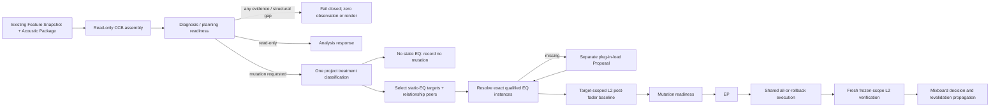

# C1 Frequency Cleanup v1

## Capability identity

- Capability: `fine_mix.frequency_cleanup.v1`
- Context pack: `fine_mix.frequency_cleanup.context_pack.v1`
- Decision plan: `frequency_cleanup.treatment_plan.v1`
- Verification: `frequency_cleanup.verification.v1`
- MOM input: `mom.frequency_relationship.v1`

## Responsibility

C1 is the project-level frequency-cleanup specialist. It reads the complete project frequency relationship, classifies every project track, and may turn only justified time-invariant corrections into a confirmed static-EQ batch.

C1 is not a generic EQ command parser. A selected-track or exact plug-in EQ request stays with the ordinary Agent capability `agent.effect.eq_control.v0`. C1 owns whole-project diagnosis, cross-track prioritization, treatment classification, execution ordering, and Mixboard impact.

The treatment plan must classify every supplied track exactly once as one of:

- `static_eq`
- `defer_dynamic_processing` (C2)
- `defer_space_processing` (C3)
- `defer_automation` (C4)
- `arrangement_or_source`
- `no_change`

Only `static_eq` items may generate actions. Deferred, source/arrangement, and no-change items cannot enter the EQ batch.

## Evidence and readiness

C1 has three deterministic readiness gates:

1. Diagnosis readiness requires a valid full-project `frequency_relationship`, a complete project track roster, usable static frequency evidence, and one uniform known tap.
2. Planning readiness requires the diagnosis-ready compact CCB. C1 assembles it read-only from the current project state, Feature Snapshot, prior exact-material C1 observations, and Acoustic Package facts. Current-project L2 reuse requires exact project/track/clip/source identity; exact-source pre-FX L3 may cross a project/session label only under its stronger source-material contract. Assembly does not call `mix.observe`, start project analysis, or persist a new Observation/Mixboard/Context Pack.
3. Mutation readiness is evaluated only after the LLM has classified every track and selected exact `static_eq` targets. It additionally requires a current-revision `track_post_fader` baseline for those targets and any tracks sharing their diagnosis candidates. `source_file_pre_fx` L3 supports diagnosis but never substitutes for this target post-FX baseline.

Target preflight reuses an exact track-state-fingerprint L2 cache row when available; otherwise it calls the existing Kernel `l2_render_probe` only for the frozen target/relationship scope. It does not route through the full `mix.observe` lifecycle and does not create per-track Mixboard observations. Post-execution verification forces fresh L2 evidence for that same frozen scope only.

If diagnosis readiness has any evidence hole, C1 fails closed and reports the missing contract. Readiness never calls an observer, starts an L2 probe/render, or persists replacement evidence. Offline observation preparation and project loading are responsible for materializing the current exact-source evidence before C1 assembles its CCB.

Energy overlap rows remain candidates, not psychoacoustic masking facts. Missing persistence evidence is disclosed as a warning and prevents claims about transient versus persistent behavior; it does not silently become a static-EQ fact.

## State flow

Readiness is not authorization. Plug-in loading and EQ parameter writes are separately frozen and confirmed. Exact track/plugin identity, generic topology generation, planned writes, and parameter preimages are part of the frozen plan.

After a confirmed plug-in-load batch, C1 reuses the already frozen treatment classification, resolves the newly loaded exact instances, and collects a target-scoped same-tap post-FX baseline before creating the parameter Proposal. It does not rerun full-project classification. The pre-load target baseline is never reused as if it were the immediate post-load EQ-parameter preimage.

## Shared execution seam

C1 does not define an observer, EQ recognizer, topology model, or executor. It reuses:

- MOM frequency relationship projection and existing DAD L2/L3 evidence;
- existing loaded-instance qualification and generic static-EQ topology;
- ordinary Agent semantic static-EQ action contract;
- `planSemanticEQReadOnly` materialization and frozen parameter preimage;
- the shared project semantic-EQ batch port for apply, reverse-order rollback, and recovery;
- Project History persistence and Mixboard terminal projection.

B4 remains a compatibility wrapper over the same configurable project EQ batch seam.

## Verification semantics

Execution verification requires:

- every leaf structural readback passes;
- the frozen target baseline schema and exact requested track set are present in the ActionSet;
- before/after project identity and `track_post_fader` tap are identical;
- every frozen target has a ready render revision, exact track-state fingerprint, bands, and evidence ref;
- post-execution rows are freshly rendered for that same frozen target set.

The verifier records changed post-FX target dimensions and evidence refs. It reports `user_acceptance=unknown` and does not claim audible improvement. A comparable observation is still reviewable evidence, not user listening acceptance.

## Performance and timing contract

C1 exposes separate timing stages for existing-evidence assembly/CCB, LLM classification, target preflight, proposal materialization, and post-execution verification. Any pre-LLM observation or L2 render is a contract violation. Acoustic Package and prior-observation reads may be cached by unchanged file metadata; cache reuse never weakens source revision/fingerprint checks. Acoustic Package L2 without a track-state fingerprint may support diagnosis but cannot become a mutation baseline cache hit.

## Mixboard impact

C1 reads frequency relationships, roles, static levels, low-end relationships, band energy, current static EQ, and plug-in chain state. A completed C1 parameter batch writes `frequency_balance`, `spectral_tone`, `static_eq`, and `plugin_chain` dimensions.

That invalidates relevant B2 and B4 decisions to `needs_review`; B3 remains verified unless a dimension it actually reads changes. The separately confirmed C1 plug-in-load prerequisite is not published as the final C1 mixing decision; the parameter batch publishes the decision.
