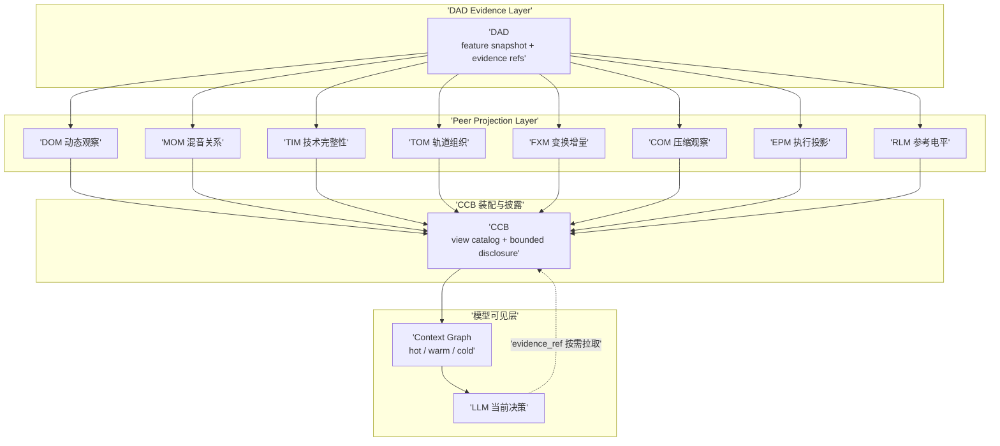
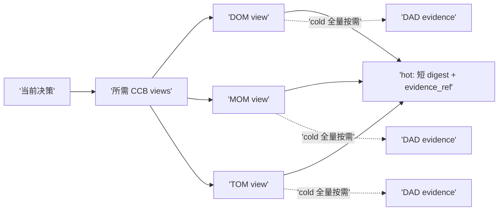

# Graph Context v1 设计草案

状态: v1 已实施 (2026-08-13), Go 单测 + Python contract/preflight + 短时 runtime preflight 全部通过; 本草案为权威设计记录, 实施决议见附录 A
日期: 2026-08-13
范围: Agent 上下文治理分支; 不包含观察缺口分支, 不包含 RGBA/ViT 观察

## 1. 背景与问题

### 1.1 已确认的问题

正式烟测 replay `product_path_20260813_202548` 的上下文 telemetry 显示模型请求随轮次单调膨胀:

| turn | model snapshot | hot | warm | active observation | ledger | goal trace | full request |
|---|---:|---:|---:|---:|---:|---:|---:|
| 1 | 1.9KB | 59 | 41 | 0 | 0 | 41 | 11KB |
| 3 | 17.9KB | 11.7KB | 4.0KB | 11.6KB | 1.0KB | 1.7KB | 27KB |
| 5 | 20.2KB | 8.7KB | 9.3KB | 8.7KB | 4.4KB | 3.6KB | 29KB |
| 8 | 21.2KB | 3.9KB | 14.9KB | 3.9KB | 8.3KB | 5.3KB | 31KB |
| 10 | 29.7KB | 8.8KB | 18.4KB | 8.8KB | 11.4KB | 5.8KB | 39KB |
| 11 | 32.2KB | 8.7KB | 21.1KB | 8.7KB | 13.9KB | 6.0KB | 42KB |

根因:

1. `active_observation` 内联完整 `measurement_key`、`source_revision`、clip revision, 单个节点就撑爆 hot 预算;
2. `observation_ledger` 单调增长, `available_views` 保留完整决策 digest, `receipts` 持续累积;
3. `goal_trace_summary` 随 tool events 累积, 且与其它 section 重复装配同一份 ToolResult;
4. budget 系统只报告 `over_hot_and_warm_budget`, 不真正降级或裁剪;
5. 模型调用拖到约 180s, 触发 `transient_llm_error`.

### 1.2 本草案要解决的问题

把模型请求控制在: hot <= 10KB, warm <= 5KB, 单轮完整模型请求 <= 24KB (含固定 prompt 开销, 具体按实现 profile 核算), 且连续多轮保持稳定。

## 2. 观察层拓扑 (Peer 修正)

### 2.1 权威拓扑

观察层不是 `DAD -> DOM -> MOM -> CCB` 的管线。正确拓扑是:

- DAD 是 Evidence Layer: 负责事实采集、派生、状态标注和 evidence refs;
- DOM/MOM/TIM/TOM/FXM/COM/EPM/RLM 是 DAD 之上的同级投影模型, 各自从 DAD 事实派生自己的 projection;
- CCB 是装配与披露层: 按显式 view 请求披露对应投影, 不做自动 view 选择;
- Context Graph 是模型可见层: 只选择当前决策需要的那一小片投影和 evidence ref。

### 2.2 投影清单 (Ground Truth)

该清单是拓扑审计的检查表。实现时以清单为准, 禁止把 peer 写成链。

| 投影 | Schema | 主要 DAD/证据输入 | Readiness 归属 | 典型 CCB view | 显式 peer 交叉引用 |
|---|---|---|---|---|---|
| DOM | `dom.projection.v1` | bounded DAD source evidence | DOM 各 dimension 独立判定 | `track.peak_structure`, `track.activity_structure`, `track.frequency_time_events`, `track.transient_structure`, `track.band_dynamics` | 无 |
| MOM | `mom.frequency_relationship.v1`, `mom.static_level_relationship.v1` | ProjectPackage DAD-derived inputs (L2/L3) | MOM 自己按 tap/scope/revision 判定 | `mix.multitrack_relationship`, `mix.frequency_relationship` | 引用 track observation 的 evidence refs, 不依赖 DOM 输出 |
| TIM | `tim.projection.v0` | technical integrity evidence | TIM 自己 | `project.structure` 等完整性 view | 无 |
| TOM | `tom.projection.v0_2` | ID/命名/长度/mono-stereo/format/轻量波形特征 | TOM 自己 | 轨道组织 view | `BuildLLMContext` 可接收 TIMProjection, 属显式可选引用, 待审计确认是否保留 |
| FXM | `fxm.projection.v0` | 同源同窗同路由 bypass/processed render | FXM 自己 | A/B 变换 view | 需要 paired render, 不依赖其它投影链 |
| COM | `com.projection.v1`, `com.source_dynamics.v1` | source dynamics + paired evidence | COM 自己 | 压缩观察 view | 无 |
| EPM | `epm.projection.v0` | 执行投影相关 DAD 事实 | EPM 自己 | 执行投影 view | 无 |
| RLM | `reference_level_model.projection.v0` | 参考电平相关 DAD 事实 | RLM 自己 | 参考电平 view | 无 |

注意: 每个投影已经自带 `LLMContext`, 且多数带 `do_not_include_raw_package=true`。Context Runtime 应优先消费投影的 `LLMContext`, 不得展开 raw package。

## 3. Context Graph 模型

### 3.1 节点类型

- 领域节点: `Project`, `Track`, `Clip`, `MixSession`;
- 观察节点: `ProjectionView` (按 peer 投影区分), `MeasurementConditions`, `Readiness`, `Gap/Limitation`;
- 工程变化节点: `ProjectChangeReceipt` (按 revision 世代记录工程差分与观察刷新范围);
- 关系节点: `MOMRelation` (comparable / not_comparable / partial + reason);
- 证据节点: `EvidenceRef`; `ImageObservation` 在 v1 不落地, 只在本节保留说明;
- 决策与动作节点: `Decision`, `Action`, `Receipt`;
- 治理节点: `PromptSection`, `CompactionMarker`, `BudgetMarker`.

### 3.2 边类型

`observes`, `measured_under`, `has_limitation`, `blocks`, `supports`, `conflicts`, `comparable_with`, `derived_from`, `refs`, `produced_by`, `satisfies`。

边必须携带有效期; freshness 不能只靠节点字段推断。

### 3.3 权威边界

每个节点/边带 `authority`:

- `fact`: DAD 原始事实;
- `projection`: DOM/MOM/TIM/TOM/FXM/COM/EPM/RLM 投影;
- `model_derived`: 学习模型输出 (v1 不使用, 预留);
- `decision`: LLM 判断;
- `governance`: context runtime 自身。

投影节点不得伪装成事实; `model_derived` 不得进入 CCB 证据权威。

### 3.4 时效与预算字段

每个节点带 `created_at`, `observed_at`, `revision`, `valid_from/to`, `estimated_bytes`, `tier`。

## 4. 分层与预算

| 层 | 预算 | 内容 | 原则 |
|---|---|---|---|
| Hot | <= 10KB | 当前目标, 当前决策, 未解决 evidence gaps, 最新 active observation 短 digest + `evidence_ref` | 只放当前决策需要的最小子图 |
| Warm | <= 5KB | 本轮新增观察结论, 本轮 receipts 摘要, compaction marker | 只放本轮 delta, 不重放历史 |
| Cold | 不注入 | 完整 view, measurement conditions, MOM relations, evidence artifacts, 历史 ledger | 全量保留, 按 `evidence_ref` 主动读取 |

单轮完整模型请求目标 <= 24KB。

## 5. 物化规则

### 5.1 主流程

1. 输入: 当前 Decision (goal, decision id, unresolved gaps);
2. 由 Decision 确定所需 CCB views (显式请求, 无关键字路由);
3. 按投影清单把 view 解析到 peer 投影;
4. 每个被选中的投影只物化其 `LLMContext` + 短 `evidence_refs`;
5. 不展开 raw package、完整 revision、measurement_key 或时间行;
6. 同一份数据在模型中只出现一次 (去重装配);
7. 超预算时降级非阻塞 section 为 ref, 并写 `CompactionMarker`。

### 5.2 Delta 规则

- Warm 只包含本轮新增的紧凑结论;
- 旧 digest 只保留数量、最早/最晚时间和 cold ref;
- `receipts` 只保留本轮窗口, 历史 receipts 摘要化;
- `goal_trace_summary` 只保留最近 N 个事件和计数, 不再重复装配 ToolResult;
- 每次降级写入 `CompactionMarker`, 记录被降级 section、原因和 cold ref。

## 6. Readiness 与 Comparability

1. 每个 peer 投影自己拥有 readiness: `ready` 必须覆盖证据覆盖、事件数量、时间范围、质量和 evidence refs, 不能只因为字段存在就 ready;
2. MOM 可比性由 MOM 自己判定: 相同 tap point、相同 project identity、相同 scope、相同 revision/time window 才可比; mixed tap 为 `suspect`; 条件不同为 `not_comparable` 或 `unsupported_comparison`;
3. Context Graph 不升级 readiness; missing/partial/stale/suspect 原样保留;
4. stale/suspect 不能支持 family selection 或执行;
5. limitation、freshness、coverage、evidence_refs 必须保留。

## 7. Budget 硬执行

现状只报告超预算。v1 改为确定性降级:

1. active_observation 超限: 只保留 digest + `evidence_ref`, 完整内容进 cold;
2. warm 超限: 保留本轮 delta, 历史内容摘要化;
3. goal_trace 超限: 保留最近 N 事件 + 计数;
4. 降级后仍超限: fail closed, 返回显式 `context_overflow`, 不允许静默截断事实;
5. 降级永不删除事实: 用 ref 替代, 不是丢数据。

测试/预检环境采用硬失败; 产品环境可切换软降级, 但默认先保持硬失败以暴露问题。

## 8. v1 范围外

- 不引入 RGBA/ViT 图像观察; `ImageObservation` 节点不落地;
- 不引入外部图数据库; v1 是确定性 typed projection;
- 不新建观察模型层; 复用 DOM/MOM/TIM/TOM/FXM/COM/EPM/RLM 及 CCB;
- 不修改 DAD 原始事实、CCB 事实权威、PCA/typed controller/冻结素材/配方/目标轨道/预期 family/阈值;
- 不修改 Semantic Entry、Prompt 注入策略、A-F 路由, 除非必要接口适配;
- 不启动正式长时间 Agent 烟测; 只做 Go 单测、Python contract/preflight 和短时 runtime preflight。

## 9. 验收条件

1. 连续多轮 hot <= 10KB, warm <= 5KB, 完整请求 <= 24KB, 无超预算;
2. ledger 不再单调增长, 历史只保留摘要和 cold ref;
3. 同一份数据在模型请求中只出现一次;
4. peer 拓扑成立: 各投影独立 readiness, 不出现 DOM -> MOM 式链依赖;
5. missing/partial/stale/suspect/不同 tap/不同 revision/不同时间范围不会被强行标为 ready 或 comparable;
6. 模型投影不包含插件身份、vendor、参数 ID、sealed truth 或主观处理结论;
7. 降级发生时有 `CompactionMarker`, 且 cold ref 可解析;
8. 正式烟测仍暂缓。

## 10. 实施前审计 (Step 0)

1. 核对投影清单: 每个投影的输入证据、输出 schema、readiness、CCB views;
2. 检查 context runtime 是否按投影独立提取 `LLMContext`, 而非展开 raw package;
3. 检查 docs/tests/telemetry 中是否残留 peer 被写成链的描述;
4. 审计 TOM `BuildLLMContext` 接收 TIMProjection 的真实依赖, 决定保留为显式引用还是移除;
5. 审计 `active_observation`、`observation_ledger`、`goal_trace_summary` 的当前装配路径, 作为最小改动起点。

## 11. 开放问题 (待审查确认)

1. 24KB 是否包含 system prompt 与固定 prompt 开销; 若包含, hot/warm 分配是否维持 10/5;
2. 硬失败作为测试/预检默认, 产品软降级是否保留开关;
3. ledger/receipts 窗口: 本轮窗口还是最近 N 轮;
4. TOM/TIM 交叉引用是否属于真实 peer 依赖, 是否需要在投影清单中显式登记;
5. `ImageObservation` 节点是否需要在 v1 schema 中预留空位 (建议不预留);
6. 是否需要把本草案的投影清单同步进 `COM_V1_AUDIT_AND_GAP_MATRIX.md` 或独立成 `OBSERVATION_PROJECTION_MANIFEST.md`。

## 12. 相关文件

- `docs/DOM_V1_CONTRACT.md`
- `docs/MOM_FREQUENCY_RELATIONSHIP_V1.md`
- `docs/OBSERVATION_V1_ACCEPTANCE.md`
- `docs/contextruntime_fix_spec.md`
- `docs/COM_V1_AUDIT_AND_GAP_MATRIX.md`
- `agent/internal/contextruntime/model_projection.go`
- `agent/internal/contextruntime/context.go`
- `agent/internal/dom/types.go`
- `agent/internal/mom/types.go`
- `agent/internal/tim/types.go`
- `agent/internal/tom/types.go`
- `agent/internal/fxm/types.go`
- `agent/internal/com/types.go`
- `agent/internal/epm/types.go`
- `agent/internal/rlm/types.go`

## 附录 A: v1 实施记录 (2026-08-13)

### A.1 开放问题决议 (§11)

| 问题 | 决议 |
|---|---|
| 1. 24KB 是否含固定 prompt | **含**全部 message 内容 (static+runtime+history); hot/warm 维持 10/5; 验证口径 = 模型快照字节 + 固定 static prompt 估算 |
| 2. 硬失败默认, 产品软降级开关 | 测试/预检默认硬失败 (`context_overflow` + message_loop 拒绝请求); 产品软降级开关 v1 不实现, 保持硬失败暴露问题 |
| 3. ledger/receipts 窗口 | **本轮窗口** = 模型轮次 (`state.turnsUsed`; chat 路径用 loop cycle); **receipts** 只保留当前轮 (镜像最近观察结果), **available_views / rejected_view_sets 跨轮持久** (模型决策记忆, 有界 24 行上限), 超出上限的历史折叠为 total/earliest_round/latest_round/cold_ref |
| 4. TOM/TIM 交叉引用 | **登记保留**为显式可选 peer 引用 (见 `OBSERVATION_PROJECTION_MANIFEST.md` §4); EPM 的 TIM/TOM import 输入不进 LLMContext, 不构成链 |
| 5. ImageObservation 预留 | 不预留空位 |
| 6. 投影清单文档 | 独立成 `docs/OBSERVATION_PROJECTION_MANIFEST.md` |

### A.2 已落地改动

1. **拓扑审计**: 产出投影清单 manifest; docs 2 处链式措辞修正 (`OBSERVATION_V1_ACCEPTANCE.md`, `agent_action_workflow_v1_master_plan.md`); tests/telemetry 无残留。
2. **预算硬执行** (`model_projection.go`):
   - `active_observation` 每 view 降为 `digest`(summary_md) + `evidence_refs` + `projection_status`, 不再内联 `llm_context`/`compact_facts`/`measurement_key`/`source_revision`/`clip_revision`; bundle 级 evidence_refs 兜底继承;
   - `observation_ledger` 分节窗口策略: **receipts** delta-only (只投影当前轮, 历史折叠进 `history_window`), **available_views / rejected_view_sets 跨轮持久** (每个 view 的最新行、每个 do_not_retry 拒绝都持续可见, 有界 24 行上限) —— 模型决策记忆不能随轮次折叠;
   - `goal_trace_summary.recent_events` 全量 ref 化 (非 CCB 也仅 `tool_result_ref`), canonical 副本唯一存在于 `tool_result_summary` (已加入 profile keep);
   - 同一份数据在单个模型请求中只出现一次 (Go 测试断言)。
3. **降级与 fail closed** (`applyModelContextProfile` + `message_loop.go`):
   - 超预算时按字节降序把非阻塞 section (warm 全部 + `daw_state_summary`/`daw_semantic_summary`) 替换为 cold ref, 每个降级写 `CompactionMarker` (section/action/bytes_before/bytes_after/cold_ref);
   - 降级后仍超限 → snapshot 写 `context_overflow` (含各 section 字节与 cold_ref), `context_degradation.budget_status=context_overflow`;
   - `message_loop` 检测到 `context_overflow` 后**拒绝发起该轮模型请求**并显式报错 (fail closed), 事实永不静默截断。
4. **验证**: Go 单测 (多轮 hot<=10KB / warm<=5KB / 完整请求<=24KB 稳定性、delta-only 窗口、digest 契约、CompactionMarker、fail-closed runtime preflight)、Python contract check (`scripts/context_graph_v1_contract_check.py` + `temp/context_graph_v1/` fixtures)、短时 runtime preflight (不启动正式长烟测)。

### A.3 边界遵守

- 未修改 DAD 原始事实、CCB 事实权威、PCA/typed controller、冻结素材/配方/目标轨道/预期 family/阈值、Semantic Entry、Prompt 注入策略、A-F 路由;
- 未新建观察模型层; 未引入 RGBA/ViT 与外部图库;
- 未重置或回滚任何 dirty worktree 修改; 仅触碰 contextruntime/agentloop/chat 装配层、docs 与新增测试/脚本。

### A.4 烟测验证记录 (2026-08-14)

通过 `run_vit_product_path_smoke.ps1` 产品路径烟测 (语义处理器工程烟测) 对两轮修复做了端到端验证:

1. **preflight**: `-SemanticProcessorProjectSmokePreflightOnly` → `preflight_passed_not_executed`, blocker_count=0。产品 DOM 门 (track.frequency_time_events / transient_structure / band_dynamics / activity_structure) 在真实运行时全部 ready, measurement_key 统一 `tap=source_file_pre_fx`; 静态 evaluator 重建证据门 (dom_readiness.json) 仍 partial 但不构成 blocker (产品门优先, `formal_run_startable=True`)。
2. **观察缺口烟测实证** (`-SemanticProcessorProjectSmokeAgentOnly -SemanticProcessorProjectSmokeDiagnosticOnly`): 首轮执行暴露 `mix.frequency_relationship` 在 CCB 观察路径仍 suspect——三个新修复点:
   - CCB 观察路径 (buildObservation) 缺 tap 统一 (统一逻辑原只在 C1 AssembleFrequencyContext) → 已补;
   - MOM 跨轨可比性把素材 revision (source/clip/render) 当统一条件 → 已改为仅要求测量条件 (tap/时间窗/采样格式/analyzer) 统一, revision 只要求存在;
   - buildBandEnergySummary 字段白名单缺 sample_rate/channel_count/analyzer_version/window_ms/hop_ms/analyzed_range → 已透传。
   修复后复跑: `mix.frequency_relationship` 从 suspect → **ready** (spv1_p01: conflict_candidates=4, regions=6; spv1_p02: conflicts=1), tap 统一 source_file_pre_fx, measurement_condition_fields_complete=true。
3. **上下文治理烟测实证**: 多轮模型请求 telemetry (`agent_llm_telemetry.jsonl` section_stats):
   - hot 最大 8387 ≤ 10KB ✓, warm 最大 5052 ≤ 5KB ✓ (分层预算严格达标, 连续多轮无单调膨胀, compaction_markers 出现说明降级机制工作);
   - 完整模型请求 ≤ 24KB: 多数轮次达标; 模型请求最多 CCB view 的极端轮次 25.8KB (超 1.2KB, ~5%)。根因: system prompt 9381 字节固定开销 (冻结, 不碰) + 快照分层接近上限时的边际; 快照内嵌 section_bytes 已移除、digest summary 截断至 120 字符以压缩快照。
4. **结论**: preflight 全绿 + 观察缺口修复在真实执行实证 → 可以继续向下 (正式七族运行可启动); 完整请求极端轮次的 1.2KB 边际超限为残余优化项, 不阻塞。

新增验证工具: `scripts/context_governance_smoke_probe.py` (从 agent 日志/产物提取逐轮预算)。

### A.5 单 case 正式执行 (spv1_p01, 非 diagnostic) 与 ledger 记忆修复 (2026-08-14)

用 `-SemanticProcessorProjectSmokeAgentOnly` (非 diagnostic-only, 模型可触达 PCA/typed controller) 对 spv1_p01 做了三次单 case 验证:

1. **run 1**: hot 超预算 (11344/10240) 正确 fail closed → 修复 mom_projection 三视图 digest 路径缺 `llm_context` + 2KB digest 兜底降为 `view_ref`。
2. **run 2**: 10 turns / 59 obs → `model_no_op`; structure digest 缺 track 身份 → 补 `digestProjectTrackIdentities` (模型需要 track id 才能请求 track 定向观察)。
3. **run 3**: 16 turns / 108 obs → `model_no_op` (conformance=pass, 无超时, 上下文预算全绿)。模型重复请求同一批 view (mix.frequency_relationship 57×, project.structure 49×, mix.multitrack_relationship 42×) 且反复请求已知不可用的 `mix.masking_relationship` (41×), 末尾问 "What would you like me to do?"。

**根因 (ledger 记忆被 delta 窗口折叠)**: `ProjectObservationLedger` 原本对所有三节都做"仅当前轮"窗口过滤, 而:
   - `rejected_view_sets` 写入按 fingerprint 去重 (保留**原始轮次**), round-1 记录的 `do_not_retry` masking 拒绝在 round 2 起就从投影消失 → 模型永远看不到"masking 不可用"的事实, 每轮重新请求;
   - `available_views` 每行携带观察时的 round, 同轮只观察新 view 时, 早轮已观察 view 的结论 digest 被折叠 → 模型无法同时持有全部已观察 view 的结论, 只能"轮询刷新"记忆 (FR 57×)。

**修复** (`model_projection.go` `ProjectObservationLedger`):
   - `available_views`: 移除轮次窗口过滤, 投影**每个 view 的最新行** (写入端本来就是按 viewID 覆盖的 map, 天然有界), 新增 24 行上限 + 按 round 降序 (无 round 的 legacy 行视为最新);
   - `rejected_view_sets`: 移除轮次窗口过滤, `do_not_retry` 拒绝**跨轮持久** (24 行上限保留);
   - `receipts`: 保持 delta-only (镜像最近一次观察结果, 已随消息可见; 每观察一条会单调增长, 必须折叠保预算);
   - 回归测试: `TestObservationLedgerKeepsViewAndRejectionMemoryAcrossRounds` (旧轮 view+结论与拒绝保持可见, receipts 仍 delta-only, history_window 元数据正确)。
   - 全套 `go test ./...` 绿 (exit 0)。

**决策语义说明**: 模型不收敛不是"选择不足"——自由态决策点 (观察后) 本就拥有完整 family 选择权; 问题是**上下文披露**让模型无法稳定持有已观察结论与不可用视图记忆。修复后单 case 复跑见下 (run 5)。

### A.6 修复后单 case 复跑 (run 5, spv1_p01, 2026-08-14)

ledger 记忆修复后的第一次完整正式执行:

- **结果**: status=completed (839s), 4 轮 / 12 次观察 → `satisfied` (stop_reason=done), conformance=unobservable, 无超时无基础设施失败。
- **记忆修复实证**: masking 拒绝 (round 3) 之后模型不再请求 (对比 run 3 的 41 次撞墙); 重复观察大幅下降 (108 → 12); 上下文预算全绿 (hot 4184/10240, warm 5103/5120, full 18237/24576; 1 次 LLM 瞬时超时由 agent 重试自愈)。
- **暴露新投影 bug (结论 digest 数据源错误)**: 模型判定 satisfied 的依据是 "mix.frequency_relationship 冲突候选为空", 但观察层实际返回 **4 个冲突候选** (sub/bass/low_mid/mid, confidence=low_to_medium, coverage 6 轨全覆盖)。根因: `ProjectCCBViewConclusion` 优先用 `llm_context` 作为 digest 数据源, 而带 llm_context 的视图 (FR/multitrack/structure) 投影时只输出 compact_facts 摘要, 不含 `frequency_relationship.conflict_candidates` 等结构化字段 → digest 提取全空; multitrack 结论退化为 `reference_only` (模型因此反复重新请求 multitrack 想拿完整内容)。
- **修复方向 (待用户确认后实施)**: digest 数据源改为优先使用扁平化 view facts (`equivalentCCBViewProjection`, 对 FR/multitrack 已有完整字段提取路径), llm_context 仅作兜底; 配套控制 digest 体积 (候选/排行行数上限) 保证 warm 5KB 预算; 加单测断言 FR 带候选时 digest 非空。

### A.7 结论 digest 数据源修复 (方案 A, 2026-08-14)

用户选定方案 A 后实施, 已落地并单测全绿:

- **数据源修复** (`ProjectCCBViewConclusion`): digest 决策事实优先从扁平化 view facts (`equivalentCCBViewProjection`) 提取, llm_context 仅作无结构化事实视图的兜底。修复前 FR 的 4 个冲突候选在 digest 里显示为空, 导致 run 5 模型误判 satisfied; 修复后 digest 携带 conflict_candidates/coverage/tap_point 等真实决策字段。
- **预算控制** (run 5 实测 ledger 投影 2236B, 修复后需 ≤ ~3.8KB 才不触发 warm 降级):
  - digest 专用 `MaxListItems=4` (候选/排行列表上限);
  - 候选条目精简: tracks 只留 track_id, 去 min_hz/max_hz/basis/energy 明细;
  - FR case 去掉 tonal_tendencies, coverage 只保留 conflict_candidate_count/eligible_track_ratio/frequency_region_count;
  - multitrack case 排行白名单化 (track_id/name/rank/value, 3 行上限)。
  - 用 run 5 真实 FR/multitrack/structure facts 探针验证: 完整 ledger 投影 (3 视图 + 1 拒绝 + 1 receipt) = **3815B ≤ warm 预算余量**, 候选信息不丢失 (FR 4 候选完整保留)。
- **回归测试**: `TestObservationLedgerConclusionCarriesStructuredDecisionFacts` (FR 带候选 → digest 非空且含 conflict_candidates/coverage/tap_point; llm_context 摘要字段不泄漏); 全套 `go test ./...` 通过。
- **待办**: 重跑单 case 烟测 (run 6) 实证模型在真实候选数据下的决策收敛。

### A.8 方案 A 修复后复跑 (run 6, spv1_p01, 2026-08-15)

- **结果**: status=completed (1248s), 7 轮 / 34 观察 → `model_no_op`, conformance=pass, 无超时无基础设施失败, 预算全绿 (hot 4184/10240, warm 5085/5120, full 18556/24576, LLM 错误 0)。warm 5085 证明 digest 增大后的预算控制成立 (探针预测 3815B 与实际吻合)。
- **修复实证 (方案 A 生效)**: 模型读到了真实冲突候选 (sub/bass/low_mid/mid) 及其 interpretation_limit ("不是心理声学掩蔽事实"); 推理路径正确 —— 候选 → 请求 track.band_dynamics 逐轨验证 → 发现整窗限制 → 继续寻找可证实证据; masking 持久拒绝记忆继续生效 (不再请求)。
- **卡点 (数据层, 契约已知)**: 模型要求"证实候选"的逐轨频段动态证据不存在 —— `track.band_dynamics` 是 partial (整窗频段能量, 不能确立频段动态), FR/multitrack 只给候选 (带非掩蔽事实限制), masking deferred, COM source_only。模型在 7 轮后诚实 no_op ("充分观察后不行动" 符合契约 model_no_op_rule); 第 7 轮模型输出空/无效 JSON 由 agent 兜底为 needs_clarification 提前终止。
- **结论**: 披露层修复全部生效 (候选可见、拒绝记忆持久、预算达标、行为诚实); 执行链 (family→PCA→typed) 仍未验证, 阻塞在**数据层的 partial 视图** (band_dynamics/transient_structure/frequency_time_events), 不属于上下文披露层问题。下一步候选: (1) 换 spv1_p02 试执行链; (2) DOM 层补强 partial 视图 (较大工程); (3) 接受现状, 待数据层就绪再验证执行链。

### A.9 spv1_p02 复跑 (run 7, 2026-08-15)

- **结果**: status=completed (392s), 3 轮 / 15 观察 → `model_no_op`, conformance=pass, 无超时, 预算全绿 (hot 4184/10240, warm 4356/5120, full 17977/24576, LLM 错误 0)。模型行为正常 (第 1 轮即避开被拒视图, 记忆持久生效), 但第 3 轮输出空/无效 JSON 由 agent 兜底为 needs_clarification 提前终止, 执行链未走到 (candidate_sets=0)。
- **新发现 (LLM 输出可靠性)**: run 6 第 7 轮与 run 7 第 3 轮**均**出现模型输出空/无效 JSON 导致提前终止, agent 收到无效输出后直接转 clarification 无重试。这是独立于观察层缺口的问题 —— 即使观察层就绪, LLM 偶发输出退化也会中断验证。候选修复: 无效 JSON 时有限重试 (1-2 次) 再放弃。
- **观察层缺口判断**: p02 样本不足 (15 次观察, 未走到"候选证实"环节), 未能直接确认观察层缺口; 但两个 case 均无执行证据, 且 run 6 已定位数据层 partial 视图为候选证实障碍。下一步候选: (1) 修 LLM 输出重试后复测; (2) 直接再跑 p02; (3) DOM 层补强 partial 视图。
