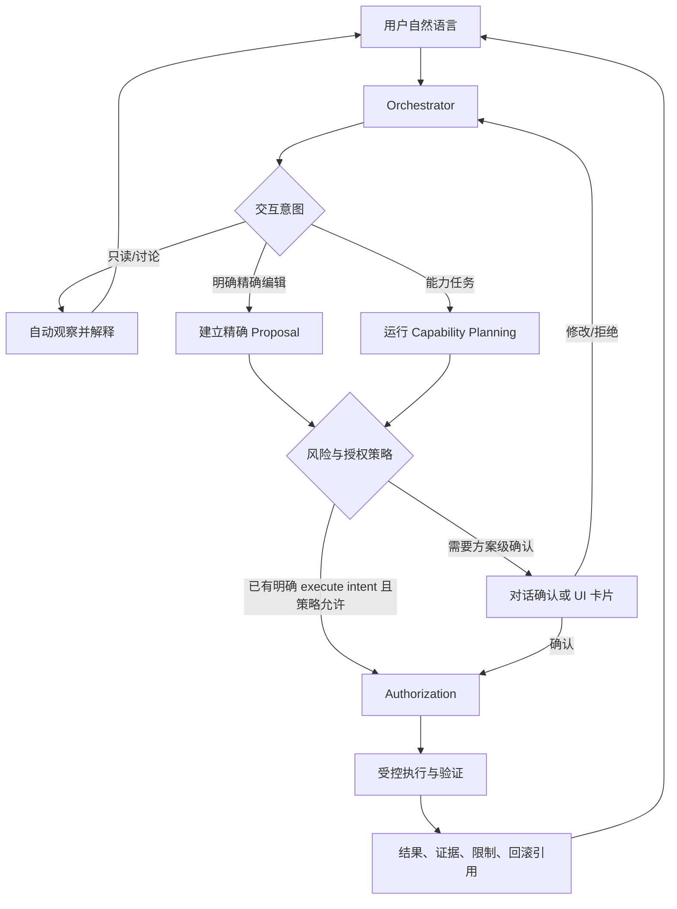
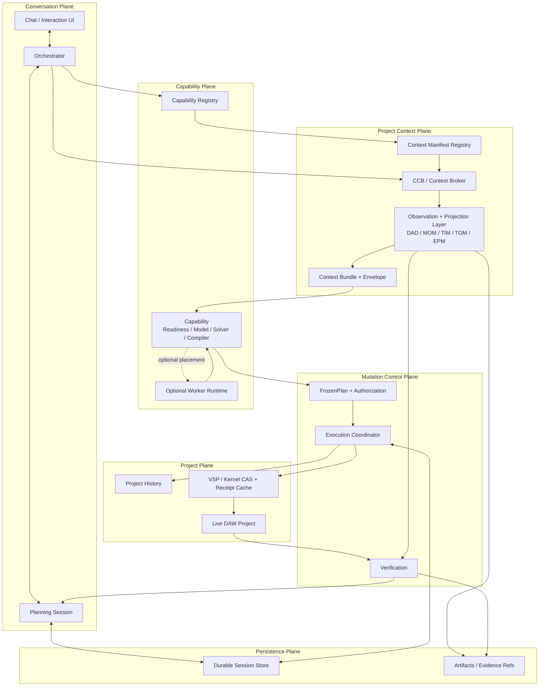
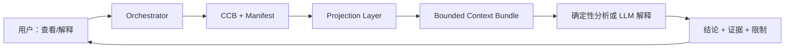
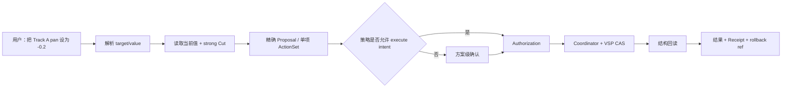
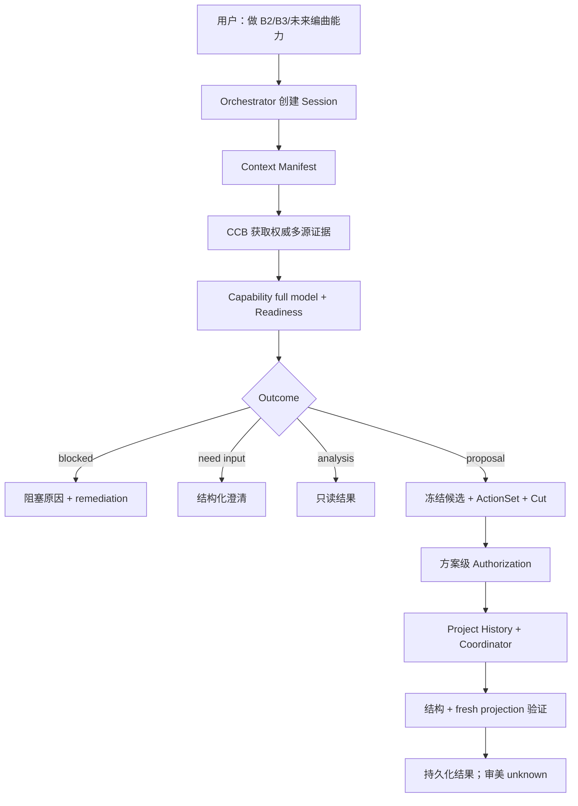

# Vit Project-aware Capability Orchestration Architecture v1

状态：Normative v1  
日期：2026-07-13  
适用范围：Vit Agent、CCB、Observation/Projection Layer、Capability Layer、Project History、VSP/VMS 与未来 Worker Runtime

## 1. 目标

Vit 的交互继续保持通用 Agent 的自然语言体验：Agent 可以先自行查阅工程、解释判断、与用户讨论；当用户表达明确执行意图或确认一个方案后，再通过受控协议修改工程。

Vit 不再把 DAW 当成通用文件系统。工程观察、混音/编曲语义、能力推理、写入、验证和持久化必须由不同组件拥有。多 Agent/Worker 只用于隔离可并行或重计算任务，不改变 authority，也不能消除观察与能力上下文本身的成本。

v1 的核心约束：

1. 一个 Planning Session 只有一个不可变 `engine_owner`。
2. Orchestrator 负责生命周期和对话，不直接成为所有领域能力的实现者。
3. CCB 按 Context Manifest 获取权威证据；前端 payload 不是执行真相。
4. Capability 只消费受控 Context Bundle，输出 typed outcome/proposal，不直接调用 mutation 工具。
5. Worker 是可选执行位置，不是 authority；无 Worker 时同一协议可在进程内运行。
6. 唯一 mutation authority 是 Execution Coordinator，经 FrozenPlan、Authorization、strong ProjectCut、Project History 和 VSP CAS 后执行。
7. Structural、acoustic/MOM 与 user acceptance 分开验证和持久化。
8. 同一 Session 禁止 dual-write；Strangler 迁移期按 Session 固定 owner，完成 cutover 后旧状态只能单向退役，不能恢复执行。

## 2. 用户交流结构



确认是方案级授权，不是每个底层 Action 都弹一次确认。以下情况必须停在确认或澄清：

- 批量、不可逆、外部发布或风险未知；
- target/scope 不完整；
- Readiness、ProjectCut 或 verification contract 不满足；
- 用户仍在比较候选或只要求查看；
- 前一次授权绑定的 Proposal/Cut 已 stale。

只读操作不需要确认。低风险精确编辑是否可直接执行由产品策略决定，但即使采用自然语言 execute intent，也必须先形成并冻结可审计 ActionSet，不能把一句自然语言直接映射成裸工具调用。

用户可以只建立一个长期目标；它是对话层的外部容器，不等于单个 Planning Session。Orchestrator 在该目标内自主推进多个观察、能力调用和验证门禁，每次 capability invocation 建立独立 Session。内部阶段完成不要求用户重新开启目标；只有上面的产品语义分叉、授权边界、stale Cut 或真实高风险操作才暂停。这样保留通用 Agent 的长轮次体验，同时避免把跨阶段授权和工程状态压成一个不可审计的超长执行事务。

### 2.1 Proposal 交互协议（v1）

Proposal 是可讨论的分析结果，也是唯一可授权的执行候选。服务端向 Chat 同时返回自然语言 `reply`、结构化 `proposal_presentation` 和带有同一绑定信息的 `proposal_approval` interaction。前端卡片只是该协议的一个紧凑视图，不是另一套 authority；卡片按钮和用户自然语言最终都进入同一个 `ApprovalDecision` resolver。

```text
proposal_presentation
  → conclusion / analysis_summary / recommendation
  → readiness / change_groups / per-action preview
  → limitations / evidence_refs / approval_prompt

ApprovalDecision
  → approve | reject | question | revise | narrow_scope | ambiguous
  → proposal_id + revision + action_set_hash + project_cut_hash
  → source_turn_id + user_text + typed adjustments
```

默认只在消息流中显示紧凑摘要；逐轨细节、证据和限制折叠展示，不能遮挡聊天或 DAW。`approve` 必须精确绑定当前 Proposal revision、ActionSet hash、ProjectCut 和 source turn 才能生成 Authorization。提问只返回解释并保持 waiting；修改会创建不可变的新 revision、重新计算 ActionSet hash 并清空旧授权；模糊文本、过期按钮、stale Cut 和未解决的候选选择都不得执行。旧版强制 Pending modal 仅作为兼容 fallback，不再是 Capability Proposal 的语义入口。

## 3. Agent 架构



## 4. 一次 Agent 运行的内部结构

```mermaid
sequenceDiagram
    participant U as User
    participant O as Orchestrator
    participant S as PlanningSession Store
    participant C as CCB
    participant P as Projection Layer
    participant K as Capability
    participant X as Execution Coordinator
    participant H as Project History
    participant V as VSP/Kernel
    participant Q as Verifier

    U->>O: natural-language goal
    O->>S: resolve/create Session with immutable owner
    O->>C: ContextRequest(capability, manifest, cut hint)
    C->>P: authoritative read-only observations
    P-->>C: typed projections + evidence refs
    C-->>O: bounded ContextBundle / omission manifest
    O->>K: invoke with Bundle + constraints
    K-->>O: analysis / need_input / blocked / candidate Proposal
    O->>S: persist exact FrozenPlan
    O-->>U: discussion or proposal-level confirmation
    U->>O: authorize exact proposal
    O->>S: persist version-bound Authorization
    O->>X: execute Frozen ActionSet
    X->>H: create durable baseline
    X->>V: preflight strong Cut and CAS
    loop each Action
        X->>V: stable session/request ID + base revision
        V-->>X: durable/idempotent Receipt
        X->>S: persist Receipt before next Action
    end
    X->>Q: structural + fresh observation verification
    Q->>P: new read-only mix.observe/MOM
    Q-->>X: VerificationResult
    X->>S: persist full result and terminal status
    X-->>O: execution summary + evidence + rollback refs
    O-->>U: result; aesthetic acceptance remains unknown until user says otherwise
```

模型调用不是整个运行的中心。很多只读路由和确定性能力可以不调用 LLM；即使调用，输入也只能来自同一个 bounded ContextEnvelope。

## 5. 组件职责与禁止事项

### 5.1 Orchestrator

负责：

- 理解目标、识别任务类型和 capability ID；
- 解析 existing v1 Session 与 invocation sequence；历史 legacy 数据只进入单向 migration，不参与 owner resolution；
- 创建/恢复 Planning Session；
- 请求 Context，不自行拼装全量工程 dump；
- 选择交互模式：inspect、propose、execute intent；
- 向用户呈现候选、澄清、授权和结果；
- 调用 Execution Coordinator，并汇总验证结果。

禁止：

- 直接持有领域 solver 逻辑；
- 直接把自然语言翻译成 VSP mutation；
- 替 Capability 伪造 Readiness；
- 替 Verification 宣称“听感更好”；
- 在同一 Session 写 legacy pending 与 v1 PlanningSession。

### 5.2 Planning Session

Planning Session 是一次能力调用的持久化控制记录，不等于聊天线程，也不等于 Worker job。

最小字段：

```text
schema_version
session_id
project_uuid
engine_owner
revision (CAS)
status
goal / constraints
capability_invocation
active_proposal
frozen_plan
authorization
execution
created_at / updated_at
```

核心状态：

```text
analyzing
→ waiting_input | proposal_ready | blocked
→ authorized
→ executing
→ verifying
→ completed | failed | cancelled
```

规则：terminal Session 只保留审计，下一次调用创建递增的新 Session；`authorized/executing/verifying` 不允许被重新规划覆盖。

### 5.3 Capability

Capability 是领域能力契约，不是工具集合，也不是 Agent persona。

Capability Definition 必须声明：

```text
capability_id + version
context_manifest_id
supported interaction modes
readiness contract
candidate/output schemas
action compiler schema
risk class
verification contract
```

Capability 的纯逻辑阶段：

```text
ContextBundle
→ full derived model
→ deterministic Readiness
→ solver/candidate generation
→ typed CapabilityOutcome
→ selected candidate compiler
→ ActionSet
```

Capability 不向 CCB 自由索取任意数据，不直接调用 VSP，不拥有授权，也不持久化 Project History。

### 5.4 Worker

Worker 是 Capability 的可选计算承载位置。v1 不要求每个能力都创建子代理。

适合 Worker 的情况：

- 多轨可并行的重分析；
- 插件学习、AIGC、编曲候选或独立 review；
- 需要隔离工具集、超时、失败或资源配额；
- 输出可被结构化校验并按 artifact 引用返回。

不适合 Worker 的情况：

- 一次简单确定性读取或精确编辑；
- 只是为了把相同的完整观察包复制给多个模型；
- 需要共享整段主对话才能工作；
- 试图通过 Worker 绕开授权、Cut 或 Execution Coordinator。

建议的后续协议：

```text
worker_job.v1:
  job_id, parent_session_id, capability_id, status,
  context_bundle_id, allowed_tools, risk_ceiling,
  output_schema, output_artifact_refs, error

worker_result.v1:
  summary, capability_outcome, candidate_refs,
  artifact_refs, confidence, risk_report,
  unresolved_needs, recommended_next_step
```

Worker 默认只读，只能返回结果/候选/artifact。任何 mutation 必须回到父 Planning Session，重新冻结 ActionSet 并由 Orchestrator 获取授权。

### 5.5 Context Manifest 与 CCB

Context Manifest 是 Capability 的声明式数据合同；CCB 是唯一组装者。

Manifest 至少声明：

```text
source IDs and authoritative tools
required/optional evidence
row sets and identity keys
merge policies
field aliases and semantics
writable/control-target markers
freshness and trust constraints
default budget
follow-up tools
excluded raw fields
```

CCB 输出：

- `ContextBundle`：完整能力输入的受控承载和 evidence/artifact refs；
- `ContextEnvelope`：模型可见的预算版本；
- omission manifest：`not_requested / omitted_budget / available_by_ref / unavailable / stale / forbidden`。

CCB 必须接受进程内强类型 projection，并在协议边界规范化；不能依赖“经过 HTTP JSON 后类型自然消失”。

### 5.6 Execution

Execution Coordinator 是唯一写工程入口。开始 mutation 前必须同时满足：

- Session owner 为 v1；
- exact FrozenPlan 存在并与 Authorization 匹配；
- Authorization 未消费；
- ActionSet 与 ProjectCut hash 匹配；
- ProjectCut 为 strong，Kernel 已协商 apply-point CAS；
- Store durable；
- Project History baseline 已创建；
- execution port preflight 通过。

每个 Action 使用稳定 request ID；每个 Receipt 在下一 Action 前持久化。取消后不再 dispatch；崩溃恢复先 reconcile 真实工程状态，绝不盲目重放 mutation。

### 5.7 Verification

Verification 是独立阶段，不是执行成功字符串。

```text
VerificationResult:
  status
  structural
  acoustic
  user_acceptance
  evidence_refs
  summary
```

- structural：目标对象、参数值、revision 与 Receipt coverage；
- acoustic/MOM：必须是 mutation 后的新 observation，包含新 ID、revision/created timestamp、正确 intent、能力所需 evidence dimensions 与 evidence refs；
- user acceptance：默认 `unknown`，只由用户审美反馈改变。

每个 Capability 必须拥有与 Context Manifest 对称的 Verification policy。全局派生模型状态不能替代能力证据合同：B2 要求 fresh level relationship，但不要求 L3 频谱或立体声；B3 要求 fresh stereo relationship。Readiness 与 Verification 必须使用同一能力语义，避免准入允许、验收却按另一套全局门禁否决。

结构通过但能力必需的 fresh acoustic evidence 不可用时，VerificationResult 是 `inconclusive`，Session 是终态 `needs_review`。这表示 mutation 与 Receipt 已完成、不会自动重试，但能力结果仍不能宣称成功；只有显式 structural/acoustic `fail` 才进入 Session `failed`。

### 5.8 Persistence

Persistence 分为四类真相：

| 真相 | Owner | 内容 |
|---|---|---|
| Session/control truth | Durable Orchestration Store | owner、状态、FrozenPlan、Authorization、Receipt、VerificationResult |
| Project baseline/rollback | Project History | mutation 前 baseline、conversation/commit refs、回滚入口 |
| Large evidence | Artifact Store | observation、context pack、MOM/TIM/TOM、worker outputs |
| Apply idempotency | VSP/Kernel | Session/request Receipt cache、apply revision |

默认 FileStore 使用用户级路径、OS 文件锁、CAS 和原子替换。MemoryStore 没有 mutation authority。

## 6. 三种任务流程

### 6.1 只读任务



不创建 Authorization，不调用 mutation port，不创建 Project History baseline。需要持续讨论时可以有 inspect Session，但它没有执行权。

### 6.2 精确编辑任务



精确不等于裸写。即使只改一个参数，也必须有 target fingerprint、base revision、ActionSet、Receipt 和结构验证。是否要求 acoustic verification 由该精确编辑的 verification contract 决定。

### 6.3 能力任务



## 7. ProjectCut 协议

ProjectCut 绑定一次计划看到的工程版本：

```text
project_uuid
project_epoch (boot nonce scoped)
base_project_revision
consistency: bounded | strong
dependency_fingerprints
target_fingerprints
artifact_refs / derived_from
contract_versions
hash
```

`bounded` Cut 可用于讨论和只读 Proposal；只有 Kernel 协商 `command.base_revision_cas=true` 后生成的 `strong` Cut 可以执行。授权后 revision/epoch/target 变化会使旧 Proposal stale，不能静默重算后沿用旧授权。

## 8. 迁移路线

### Phase A — Branch by Abstraction

- 在 legacy AgentLoop 外建立 Store、PlanningSession、Registry、Context/Execution/Verification 接口；
- legacy 行为保持不变，先加入 owner 字段与 dual-write 检测。

### Phase B — Read-only shadow

- 选择 B2/B3，把 CCB、全量模型、Readiness、solver 接入新 Runtime；
- Shadow 只产 analysis/proposal，不创建 legacy pending，不写工程。

### Phase C — Controlled mutation

- 加入 exact FrozenPlan、Authorization、strong ProjectCut、History baseline、VSP CAS/idempotency、Receipt 和 crash reconciliation；
- 先 canary，再 live smoke。

### Phase D — Session-owned strangler cutover

- rollout 只影响新 Session；existing owner 永久固定；
- legacy pending 优先 drain；冲突 quarantine；
- 产品默认 rollout v1；此阶段的显式 rollback 只在 Phase F 前有效。

### Phase E — Close legacy creation

- live B2/B3 和 Store 多进程门禁通过；
- 项目 inventory 无 pending/conflict；
- 关闭新 legacy candidate persistence，保留一个兼容窗口的 reader。

### Phase F — Remove drain-only code

- 激活所有相关旧工程并再次盘点；
- 删除 legacy B2/B3 pending maps、confirmation execution 和 AgentLoop candidate builders；
- 保留只读旧 JSON migration/diagnostic，或明确版本化废弃。

Phase F 完成后的 B2/B3 进程内 rollback 开关不再存在；需要回滚时部署旧二进制。旧 JSON migration 会将仍活跃的 pending 终止为 `rejected` 审计记录，不会排空执行；已经 `verified/committed/failed/...` 的历史终态保持不变。

### Phase G — Optional Worker Runtime

- 先把 Plugin Prep/Track Diagnosis/Review 作为只读 Worker；
- Worker 只接收 Bundle ID/compact view，长结果写 artifact；
- 验证 allowed-tools、取消、失败隔离、并行预算和 structured result；
- 不改变父 Session 的 authorization/execution authority。

### Phase H — More capabilities, decision ledger and arrangement

- B1/B4、插件 treatment、自动化、编曲/AIGC 逐能力复用同一接缝；旧 B5 退役并作为 B2 兼容意图；
- Mixboard 只投影 Session、Project History、Receipt 和 Observation 引用，通过影响维度形成跨能力 `needs_review`，不建立第二套 authority；
- `mix_report.v1` 是只读报告；缺少最终测量、存在 unresolved/needs_review 或当前工程有未记录变化时不得声称 export ready；
- 编曲 Worker 产 ghost/draft candidate，正式写工程仍由父 Session Coordinator 完成。

## 9. 当前落地状态

已完成：Phase A–F 的 B2/B3 首批切面，包括固定 v1 owner、legacy executable authority 物理退役、单向旧 JSON migration、真实 Release Kernel live verification、完整 VerificationResult、typed projection 规范化和多进程 Store 锁。

仍保留：更广泛 `internal/agentloop` 旧测试域尚未清理；Worker Runtime 仍是 Phase G，不应被误报为当前 v1 已实现。保留的 B2/B3 legacy 类型只服务 decode-only migration，不具备确认或 mutation authority。Mixboard 决策账本合同见 `MIXBOARD_DECISION_LEDGER_V1.md`。

权威门禁与现场证据见 `PROJECT_AWARE_CAPABILITY_RUNTIME_V1_GATES.md`，代码状态见 `ARCHITECTURE_V1_IMPLEMENTATION_STATUS.md`。
