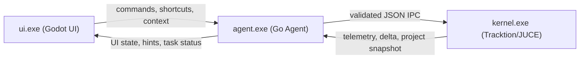

# Vit-DAW Future Roadmap Todo

## 判断依据

已参考当前仓库中的关键基础：

- [d:/Vit_DAW/docs/Vit-DAW 项目功能总览.md](d:/Vit_DAW/docs/Vit-DAW%20项目功能总览.md)：当前已有 Tracktion/JUCE headless 内核、Godot 前端、Python Bridge、ZMQ/UDP IPC、谱图烘焙与基础工程/轨道/音频/MIDI能力。
- [d:/Vit_DAW/docs/VIT_IPC_CONTRACT.md](d:/Vit_DAW/docs/VIT_IPC_CONTRACT.md)：已有 `get_project_state`、`undo/redo`、MIDI note、插件参数、AIGC asset ingest、take history 等命令契约。
- [d:/Vit_DAW/docs/V1_2_CROSS_END_HEALTH_CHECK.md](d:/Vit_DAW/docs/V1_2_CROSS_END_HEALTH_CHECK.md)：当前最高风险仍集中在 IPC 客户端一致性、增量丢包、SHM 生命周期、rack 乐观 UI 与全量回拉。
- [d:/Vit_DAW/scripts/bridge_core.py](d:/Vit_DAW/scripts/bridge_core.py)：Bridge 已维护影子工程、delta seq gap 观测、tile_ready 日志、recording stop 后强制全量刷新等能力雏形。

核心排序原则已调整：UI 不是后期美化，而是产品主线；Go Agent 不是附属工具，而是马上要接入的新中枢；高级编辑、快捷键、鼠标胶囊提示与 Agent 入口是长期基础设施。只有这些稳定后，本地模型微调、Hermes Memory、AIGC 和高级 AI 创作才进入主排序。

版本命名规则：`V1.0` 以后视为正式发布后版本；当前路线全部保持在 `V0.x`。从 `V0.81`、`V0.82` 递进到 `V0.89`，如果还需要继续细分，则使用 `V0.891`、`V0.892`、`V0.893` 这类编号。

## P0：V0.81 UI/交互设计长期主线

目标：把当前 Godot UI 从“能演示的工程界面”升级为“可长期演进、可统一设计、未来可用户自定义”的产品 UI 层。由于 UI 是 Godot 件，后续可把主题、布局、快捷键、胶囊提示等做成可配置资产，而不是写死在单个场景里。

- UI 设计系统：建立 Vit-DAW 的视觉语言、颜色、字体、控件状态、轨道/clip/rack/plugin 的统一设计规范。
- UI 架构分层：把 Godot UI 拆成主题层、布局层、业务状态层、IPC/Agent 交互层，避免未来改皮肤或自定义 UI 时重写逻辑。
- 鼠标胶囊提示系统：鼠标停在特定区域时显示该区域核心功能、当前可执行动作、对应快捷键、是否可被 Agent 操作。
- `C` 键 Agent 入口：任何时候呼出 Agent 对话框，默认携带当前 UI 上下文，例如选中的 clip、track、rack node、参数或时间范围。
- `/` 键全局快捷键设置栏：快速搜索命令、查看快捷键、修改绑定、发现未绑定功能。
- 功能按键统计：先建立完整 command/action registry，再决定哪些功能需要按钮、右键菜单、快捷键、鼠标胶囊提示或 Agent 命令。
- 调试 UI 去工程化：保留可开关诊断层，但默认界面必须脱离工程调试感，向高保真生产工具靠拢。
- 用户自定义 UI 预留：主题、布局、快捷键、面板显示、胶囊提示内容都应有配置文件或资源化路线。

## P1：V0.82 Go Agent 三进程架构

目标：尽快启动 Go Agent 连接，把未来运行形态收敛为 `ui.exe + kernel.exe + agent.exe`，并逐步替换当前 Python Bridge 的职责。

- 三进程边界定义：`ui.exe` 负责 Godot UI 与交互，`kernel.exe` 负责 Tracktion/JUCE 音频内核，`agent.exe` 负责 Agent、路由、命令验证、任务编排与模型连接。
- Python Bridge 职责盘点：梳理 `scripts/bridge_core.py` 当前承担的 UDP/ZMQ 转发、影子工程、日志、delta gap、recording stop refresh、tile_ready 观测等职责。
- Go Agent 通信协议：决定第一阶段是兼容现有 UDP/ZMQ，还是由 Agent 对 UI 暴露新协议并继续连接 kernel 的 ZMQ。
- Agent 命令验证层：所有来自 UI、快捷键、鼠标胶囊、自然语言、本地模型或云模型的动作统一进入 Go Agent command validator。
- 状态同步层：Agent 维护工程影子状态，但仍以 `get_project_state` 全量快照作为真源，delta 只做低延迟提示。
- 进程生命周期：定义启动顺序、健康检查、崩溃重启、日志路径、端口占用、版本兼容与退出行为。
- Agent 插件化路线：本地模型、云端模型、AIGC、Stem、Hum-to-MIDI、Automation Scripts 都作为 Agent task/provider 接入，而不是散落在 UI 或 Python 脚本中。
- Vit Tool Plugin Protocol：规划一个低门槛工具封装协议/模板，让用户能把网页平台、本地工具、AIGC 服务、脚本、模型包装成 Vit 可加载节点，而不要求每个人都从零实现完整 VST3/CLAP。

## P2：V0.83 快捷键、命令注册表与高级编辑基础

目标：把所有功能变成可发现、可绑定、可提示、可被 Agent 调用的命令对象，同时长期补齐 DAW 的基础编辑体验。

- Command Registry：统一登记功能 ID、显示名、上下文、默认快捷键、菜单位置、Agent 可调用性、危险级别、是否支持撤销。
- Shortcut Registry：统计现有按键与冲突，规划默认键位；特别保留 `C` 为 Agent、`/` 为全局快捷键设置。
- Mouse Capsule Registry：每个 UI 区域声明自己能显示哪些提示、快捷键和 Agent 建议。
- 对齐/吸附系统：clip/grid/beat/bar/transient/marker 的 snap 与 align 能力作为长期编辑主线。
- 选择与编辑基础：框选、多选、复制、移动、裁剪、分割、静音、锁定、组合、撤销/重做一致性。
- 时间线基础效率：缩放、滚动、播放头、区域选择、循环区、marker、批量操作。
- Rack/Plugin 操作效率：节点选择、连接、断开、参数搜索、常用参数 pin、快捷键映射。
- 所有新增编辑功能都要进入命令注册表，避免 UI 按钮、快捷键、Agent 三套系统分叉。

## P3：V0.84 IPC 契约与状态可靠性重整

目标：为了服务 Go Agent 和 UI 命令系统，重整底层契约。这里不是为了“先做 AI”，而是为了让三进程架构可靠。

- IPC 契约冻结：统一 `cmd/action` 使用规范，生成命令全集、字段 schema、错误码与最小示例。
- Godot/Agent/Kernal 兼容层：短期兼容现有 Godot 调用，长期迁移到 Agent 统一 request/reply。
- 全量状态真源策略：结构变更后强制 `get_project_state` 回拉，delta 只做低延迟显示，不作为唯一工程真源。
- IPC 稳定性修复清单：补齐 request_id 对账、超时、失败回拉、no-wait 命令和 await 命令边界。
- SHM/tile 生命周期诊断：为 waveform/spectrogram mapping 增加 handle/generation/clip 存在性日志，先确认是否泄漏再重构。
- 命令回归测试：为 UI 快捷键和 Agent 低风险命令建立 golden JSON 测试集。

## P4：V0.85 本地模型与混合算力路由

目标：在 UI/Agent/命令系统稳定后，再推进本地 SLM 和云端大模型路由。此阶段重点不是炫技，而是让模型输出可控、可验证、可回滚。

- 本地环境校准系统：硬件探测 + 短 benchmark + 模型兼容矩阵 + 运行时自适应降级，用来判断当前机器适合部署哪些本地模型。
- SLM 模型矩阵：围绕 `0.7B` 到 `8B` 的本地微调模型建立分档，例如快捷命令、JSON 修正、MIDI 补全、上下文理解、多轨建议等不同任务档位。
- 模型包管理：定义本地模型下载、校验、启用、删除、版本回滚、磁盘占用提示与用户手动覆盖推荐策略。
- Tiered Routing v1：低延迟命令走本地 SLM，复杂推演走云端模型；所有结果都进入 Go Agent validator。
- 本地 SLM 微调数据集：从 command registry、golden JSON、真实用户命令、失败修正样本生成 DAW JSON IPC 指令语料。
- 格式准确率门禁：本地 SLM 输出必须通过 schema、字段白名单、命令权限和状态前置条件检查。
- 路由可观测 UI：在 Agent Shell 或状态栏中显示“本地/云端/规则引擎/失败回退”原因。

## P5：V0.86 智能创作与 AIGC 生产力

目标：在异步任务管线和 Agent provider 架构上落地创作型功能，避免每个 AI 功能各自发明一套入口。

- MIDI 幽灵补全 v1：基于当前 MIDI clip、和弦/节奏上下文生成 ghost notes，Tab 接受后调用现有 MIDI note 写入命令。
- 多轨上下文 MIDI Model：将 MIDI 补全明确标记为核心护城河。长期目标不是单轨续写，而是理解鼓、bass、chord、melody、人声、频段与节奏密度关系的 arrangement-aware completion。
- Hum-to-MIDI v1：录入或选中人声片段后，通过 basic-pitch 类模型离线转 MIDI，回写到 MIDI clip。
- Stem Separation v1：右键 audio clip 触发 Demucs/HTDemucs 异步任务，输出 stems 并回灌为新 clips 或 takes。
- AIGC 外部吸盘 v1：先做文件/本地服务协议；Suno、MiniMax、ACE Studio、Yue 等深度 wrapper 后置。
- 异步任务中心：统一展示 AIGC、stem、hum-to-MIDI、render/import 的 pending/ready/failed/ghost 状态。
- Vit Tool Plugin Protocol MVP：为 AIGC 工具、网页端平台、本地命令行工具和模型 provider 提供可封装模板，使其能通过机架节点或 Agent provider 进入工程。

## P6：V0.87 神经记忆与 Git for Music

目标：让 AI 的修改可比较、可回滚、可学习，而不是直接覆盖主工程。

- Hermes Memory v1：记录用户自然语言意图、AI 初始方案、用户最终手动调整 diff、Accept/Reject 结果。
- 参数绑定记忆：把“底鼓要肥厚”等描述与插件链、VST 参数、轨道上下文、前后音频摘要绑定。
- AI-Native Project Metadata：在 Agent 连接后实验工程内记录 Agent 操作、生成来源、prompt、model、seed、take、branch、provider 配置等元数据；是否需要新工程打包格式由实验结果决定。
- Regenerable / Replaceable Asset：先不固定系统级或插件级实现，但工程语义上要支持可重生成、可替换、可冻结、可脱离来源的资产。
- Ghost Placeholder / Missing Dependency Shell：当效果器、clip、生成资产、外部工具找不到本体时，工程不应直接损坏；保留带语义标签的空壳占位，允许用户重新定位、替换或重新生成。
- 隐形 Bus 沙箱：为 AI 分配隔离 bus/ghost track/take stack，避免直接改主线音频链。
- A/B/C 平行分支：基于 take history、ghost state 和工程 diff 生成多个混音/编曲候选，一键 Solo 对比。
- Merge 规则：明确哪些改动可合并回主线，例如 clip、automation、plugin params、rack routing。
- ExecutionRound 对接调研：评估 `vit-lage` 子代理与 ExecutionRound 机制如何映射为 Vit-DAW 的任务轮次、候选分支和合并审计。

## 战略收束：三条长期主线

后续新增功能尽量归入以下三条主线，避免 roadmap 发散：

- AI-Native DAW Interface：Godot UI、鼠标胶囊、快捷键系统、Agent 对话框、自定义 UI 与上下文提示。
- Agent-Orchestrated Music Workflow：`ui.exe + kernel.exe + agent.exe`，所有外部工具、模型、AIGC、自动化脚本都由 Agent 编排并进入统一命令/任务体系。
- Regenerable / Branchable Music Project：Git for Music、take history、AI 原生工程元数据、可重生成资产、幽灵占位符与可合并分支。

## P7：V0.88-V0.89+ 高级音频监督与自动化实验室

目标：把 Vit-DAW 的“智能监督”从命令层推进到音频工程质量层。

- Haas Effect Monitor：实时/准实时分析相位、声像与频段冲突，先做离线或低频刷新版本，再评估实时化。
- 3D 拓扑预警：在频谱/声像空间中标红冲突区域，避免只给文字警告。
- 乐谱双向翻译：Audio-to-MIDI、MIDI-to-Score、Score-to-MIDI 分阶段落地。
- Automation Skill Scripts：封装多普勒、磁带停机、泵感侧链、自动滤波等数学包络线生成器。
- 参数自动化审计：AI 生成 automation 前后可预览、可撤销、可解释。

## 建议的首批执行清单

如果接下来立刻开工，建议先从这 12 项开始：

1. 建立 UI 设计系统文档：视觉规范、控件状态、交互原则、未来自定义 UI 边界。
2. 盘点 Godot UI 模块，标出哪些是主题层、布局层、业务状态层、IPC/Agent 层。
3. 建立 Command Registry 草案：所有按钮、菜单、快捷键、Agent 命令共用同一功能 ID。
4. 统计现有快捷键和功能入口，保留 `C` 为 Agent 对话框、`/` 为全局快捷键设置栏。
5. 设计鼠标胶囊提示的数据结构：区域 ID、功能说明、快捷键、上下文动作、Agent 建议。
6. 盘点 `scripts/bridge_core.py` 职责，决定哪些进入 Go Agent v0。
7. 定义 `ui.exe + kernel.exe + agent.exe` 的启动、健康检查、日志和退出协议。
8. 先让 Go Agent 兼容现有 ZMQ/UDP 链路，完成 ping/get_project_state/transport 的最小闭环。
9. 把 JSON schema/命令验证放进 Go Agent，而不是继续散落在 UI 或 Python Bridge。
10. 为基础编辑长期主线列第一批：对齐、吸附、选择、移动、裁切、分割、撤销一致性。
11. 建立 UI 胶囊提示与快捷键设置栏的 Godot mock，不等待完整 Agent 完成。
12. Go Agent 稳定后再启动本地 SLM、微调数据集、Hermes Memory 和 AIGC provider 的详细设计。