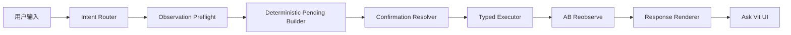
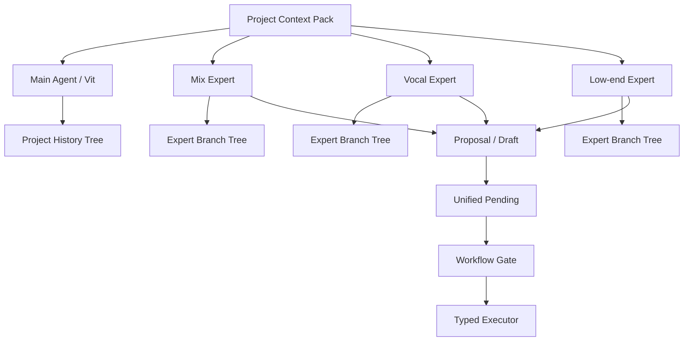

# Vit Agent Action Workflow v1 开发总规划白皮书

日期：2026-06-29  
状态：规划草案 v0.3  
主线：混音先行，编曲后置，内核替换再后置

> 规范更新（2026-07-13）：本文件保留产品能力路线与历史背景；Session owner、Context Manifest、Capability、Worker、Execution、Verification 和 Persistence 的 authority/协议，以 `PROJECT_AWARE_CAPABILITY_ORCHESTRATION_ARCHITECTURE_V1.md` 为准。旧 `PendingCandidate -> typed executor` 描述不得用于创建新的 B2/B3 authority。

## 1. 总结

当前 Vit Agent 的开发顺序确定为：

1. 先跑通自动混音。
2. 再完善 Ask Vit UI、统一 pending、confirmation、executor、AB reobserve。
3. 再引入专家/角色与临时子代理能力。
4. 最后在混音底座稳定后补自动编曲。
5. 未来替换为 LLM-native kernel 时，优先替换底层 capability adapter，不推翻 Agent Action Workflow。

核心原因：自动混音有更稳定的验收方法，能先把工程上下文、观察、证据、确认、执行、AB 对比、历史回滚、UI 表达这些底座跑通。自动编曲需要更多创作型判断，更适合作为混音闭环稳定后的上层能力。

当前阶段不做：

- 不推翻 DAD Evidence Layer / Observation Model Layer 契约，除非发现明确 bug。
- 不重写 TE 内核。
- 不做专家群聊。
- 不做专家根据其他专家或主代理对话流自动回应。
- 不做群发讨论。
- 不把两套真实工程素材全部用作开发集。

## 2. 总体架构

Agent Action Workflow v1 的唯一写工程链路如下：

关键原则：

- 混音 action intent 必须先读取 MOM projection；工程接收/整理相关 intent 必须优先读取 TIM/TOM projection。
- action preflight 不直接读取 raw acoustic package。
- trust quality 不足时，只允许建议或澄清，不创建 executable pending。
- LLM 只负责自然语言解释，不负责生成内部 pending marker。
- 用户确认前禁止写插件、参数、音量、声像。
- 用户确认后只允许走 typed executor。
- 执行后统一触发 L2 render probe / MOM AB result。
- 回复只输出中文 compact before-after、依据和可信性，不泄露 raw payload。

### 2.1 DAD / Observation Model Layer

Phase 2 开始，观测上下文统一分成两层：

- DAD = Evidence Layer。负责采集、派生和标注事实，包括 project state、feature snapshot、lightweight acoustic package、source capability、evidence refs 和缺失/可疑状态。
- Observation Model Layer 位于 DAD 之上。每个 model 面向一个工作职责，把事实层压缩为 compact projection，供 agent/LLM 读取。
- MOM = Mixing Observation Model。服务混音观察、action preflight、AB result 和混音关系判断。
- MOM v1.5 新增可复用的 `mom.frequency_relationship.v1` typed 子投影；它只承载全工程频段关系、tap/coverage/freshness、冲突候选、持续性可用性与验证维度，不承载 EQ 参数、插件选择或执行授权。详见 `MOM_FREQUENCY_RELATIONSHIP_V1.md`。
- TIM = Technical Integrity Model。服务 A2 技术完整性检查，输出 `tim.projection.v0`，覆盖 source/path/playback 有效性、格式归类、采样率/bit depth/声道覆盖率、DAD acoustic readiness、静音/削波/异常 clip 风险。
- TOM = Track Organization Model。服务 A3 智能轨道整理提案，优先按 ID/命名关联、长度、mono/stereo、格式、声像、轻量波形特征聚类，再谨慎给出角色假设。
- DOM = Delivery Observation Model。服务导出、交付、响度、格式与版本审查。
- LLM 默认消费 model projection/context，不直接消费 raw waveform arrays、spectrogram tile payload、完整工程 dump 或超长路径列表。

## 3. Benchmark 策略

两套真实工程素材不能全部作为开发样本使用，必须拆分为训练/开发集与封存测试集。

### 3.1 训练/开发集

路径：

`E:\BaiduNetdiskDownload\yingge - sattelites tracks out`

用途：

- 日常开发、调试、smoke、规则迭代的真实工程样本。
- 验证自动导入、TIM 技术完整性检查、TOM 智能整理提案、MOM projection、pending 生成、UI 展示、执行与 AB reobserve。
- 允许根据失败结果修改通用逻辑。

已知元数据：

- 61 个 WAV。
- 约 3.74GB。
- 48kHz / 24bit / stereo。
- 时长统一约 228.571 秒。
- 包含 drums、bass、synth、vocal、BV、bus、FX return、printed plugin chain 等真实混音复杂度。

### 3.2 封存测试集

路径：

`E:\BaiduNetdiskDownload\yingge - Weekend Lover tracks out`

用途：

- held-out test set。
- 平时不用于调规则，不针对轨道名写特例，不做 prompt 过拟合。
- 只在关键阶段验收时运行完整测试。
- 如果测试失败，只记录失败类型，回到训练/开发集或通用 fixture 上修复，不直接为该测试集打补丁。

已知元数据：

- 104 个 WAV。
- 约 7.22GB。
- 48kHz / 24bit / stereo。
- 时长统一约 258.641 秒。
- 复杂度高于训练/开发集，适合验证系统是否能泛化到更复杂真实工程。

### 3.3 Benchmark 纪律

- 两套素材都不进入 git。
- 只在仓库里记录 manifest、路径、元数据与 smoke artifact。
- 不在代码、prompt、规则里硬编码测试集轨道名。
- 不把封存测试集纳入日常开发循环。
- “训练集”在当前阶段指工程规则、workflow、UI 和 prompt 行为的开发样本，不代表立即进行机器学习训练。

## 4. Phase 0：基线冻结与回归门

目标：让当前重构现场有稳定起点。

Todo：

- 记录当前 dirty worktree，不回滚无关改动。
- 保留 Observation v1 acceptance smoke 作为强制回归门。
- 保留 Go regression tests。
- 保留 Godot headless parse。
- 建立 benchmark manifest v0。
- 明确训练/开发集与封存测试集的使用纪律。

必须通过：

- Go regression tests。
- Godot headless parse。
- Observation v1 acceptance smoke。
- 产品路径 smoke。

## 5. Phase 1：Agent Action Workflow v1

目标：统一混音任务状态机，完成观察、pending、确认、执行、AB result 的最小闭环。

Intent Router 固定支持：

- `read_only_observation`
- `action_preflight`
- `pending_revision`
- `confirmation_accept`
- `confirmation_reject`
- `followup_question`
- `ab_result_observation`

Todo：

- 统一 action intent 判定。
- 统一 confirmation 文本判定。
- 混音 action intent 先走 MOM projection preflight；工程完整性与整理 intent 先走 TIM/TOM projection preflight。
- trust quality 不足时阻止 executable pending。
- 本地 deterministic 构造 `PendingCandidate / MixTreatmentPending`。
- pending 必须包含 target、action_kind、processor_type、evidence_refs、needs_resolution、confidence。
- 统一 Confirmation Resolver。
- gain / pan 走 mix tick。
- plugin treatment 走 plugin prep / plugin grabber safe route。
- 无 safe route 时进入 preparation 或 clarification。
- 执行后统一触发 AB reobserve。
- Response Renderer 固定输出：结论、依据、待确认动作、限制。
- pending 卡片和文本必须来自同一份 display model。

验收 smoke：

1. 用户：“先只观察这首歌的人声和伴唱关系，不要修改工程。”
2. Agent：只读观察，输出结论、依据、限制。
3. 用户：“帮我让主唱更靠前一点，但先给我确认。”
4. Agent：生成 pending，不写工程。
5. 用户：“可以，执行。”
6. Agent：走 typed executor。
7. Agent：触发 AB reobserve，输出 before-after 与可信性。

## 6. Phase 2：真实工程训练/开发集闭环

目标：用 `sattelites` 跑通真实工程自动混音最小闭环，并把职业混音流程拆成可见、可确认、可跳转的工程级节点队列。

Todo：

- 生成 `sattelites` benchmark manifest。
- 建立 tracks out 导入或挂载路径。
- 轨道角色初判：
  - vocal
  - backing vocal
  - drums
  - bass
  - synth
  - guitar / keys
  - bus
  - FX return
  - printed plugin chain
- 生成 Project Context Pack compact view。
- 跑 Observation v1 smoke。
- 跑至少一条 action workflow smoke。
- 产出 smoke artifact，包括：
  - manifest
  - observation projection 摘要
  - pending display model
  - executor result
  - AB result 摘要

限制：

- 不把 `Weekend Lover` 用于本阶段调试。
- 不为训练集单独写轨道名硬编码规则。

### 6.1 Mix Workflow Queue v0

P2 不再只验证单条 action smoke，而是开始建立 `mix_workflow_queue.v0`。这不是 LLM 临时生成的聊天计划，而是工程黑板中的混音流程 todo list：用户和 Agent 都能看到每个职业节点是否未开始、进行中、等待确认、完成、阻塞、跳过、延期或需要复查。

节点编号采用“大阶段 + 阶段内编号”，避免一条 20 多项长数字列表难以阅读。节点是用户可讨论、可确认、可跳转的职业工作阶段；每个节点内部再挂 observation、internal checks、evidence refs、candidate actions、pending、executor result、AB review 和 rollback refs。

#### A. 工程准备 / Project Prep 能力族

A 不再只表示线性工作阶段，而是 `project_prep` capability family。编号保留用于路线图和工程黑板对照，但不表示门禁；用户可以按需要直接调用任一 A 能力。详细命名见 `docs/project_prep_capability_layer_v0.md`。

- A1. 工程接收与整理 / `project_prep.import_intake.v0`  
  导入、命名、基础轨道建立、空轨/重复轨初筛、source/path/playback 状态回收；不在本步强行判断完整角色结构。
- A2. 技术完整性检查 / `project_prep.technical_integrity.v0`  
  由 TIM 输出 `tim.projection.v0`：采样率、bit depth、声道、文件格式、文件长度、source/path/playback 有效性、DAD acoustic readiness、静音、削波、缺失素材、异常 clip。未知事实必须标记为 missing/limited，不得伪造。
- A3. TOM 智能轨道整理 / `project_prep.track_organization.v0`  
  由 TOM 基于 TIM/DAD/project facts 聚类：先看 ID/命名关联，再看长短、mono/stereo、格式、声像、轻量波形特征；角色识别只是谨慎假设，不作为唯一入口。输出文件夹轨道/路由/分组建议，等待用户确认。
- A4. Clip 编辑与片段清理 / `project_prep.clip_edit_cleanup.v0`  
  覆盖 cut、clip fade/gain、范围选择、Strip Silence、片段清理建议与确认执行。旧 A4 中的 TOM 整理确认归入 A3 的 confirmation/apply 子流程。
- A5. Marker / 段落地图 / `project_prep.section_marker_map.v0`  
  生成段落地图和 marker 建议；确认后写入工程。

`project.blackboard.status_report.v0` 是跨阶段工程黑板状态汇报能力，不编号为 A6。它记录 A-F 的当前状态、已知用户目标、风险、待确认动作和可选下一步，不把 A-F 当作线性门禁。

#### B. 粗混 / Static Mix 能力族

B 不再只表示线性粗混阶段，而是 `static_mix` capability family。B1-B4 是并列能力单元，不互相阻塞；用户可以直接请求任一 B 能力。详细契约见 `docs/static_mix_capability_contract_v0.md`。

- B1. Gain Staging / `static_mix.gain_staging.v0`  
  建立安全电平和 headroom。
- B2. 静态主次与音量平衡 / `static_mix.static_balance.v0`
  不依赖插件，用静态 track fader 建立 foreground、anchor、support 与 effects 的主次关系。
- B3. 声像布局 / `static_mix.pan_layout.v0`  
  中心元素、左右展开、宽度、mono 风险。
- B4. 低频关系 / `static_mix.low_end_relation.v0`  
  kick、bass、low synth、低频堆积和遮蔽。

旧 B5 / `static_mix.focus_position.v0` 已退役；兼容 ID 和核心元素定位、建立主次、`focus_position` 等意图统一路由 B2。频谱、动态、空间和自动化职责不并入 B2。

A-F 继续按目标非线性调用。每个终态能力 Session 向 Mixboard 写入只含 authority 引用的 `mix_decision_record.v1`；后续能力根据影响维度触发相关旧结论的 `needs_review`。`mix.report` 将该账本投影为 `mix_report.v1`，但不成为新的执行或事实 authority。

#### C. 细混处理阶段

- C1. 频段清理  
  EQ、masking、浑浊、刺耳、薄、暗、闷。
- C2. 动态控制  
  compression、transient、de-esser、limiter 候选。
- C3. 空间与深度  
  reverb、delay、send、前后层次、空间一致性。
- C4. 段落自动化  
  verse/chorus/bridge 的音量 ride、能量变化、空间变化。
- C5. 总线处理  
  drum bus、vocal bus、instrument bus、mix bus 的 glue、saturation、轻度压缩。

#### D. 母带前检查 / Pre-Master 阶段

- D1. 全局响度与峰值检查  
  integrated loudness、true peak、headroom、动态范围。
- D2. 翻译检查  
  mono、小音量、耳机、音箱、不同播放系统风险。
- D3. 参考曲对比  
  tonal balance、低频量感、vocal level、宽度、响度、空间感。
- D4. 版本输出检查  
  full mix、instrumental、acapella、TV mix、stems、不同采样率/格式。

#### E. 母带 / Mastering 阶段

- E1. 母带 EQ / Tonal Balance  
  整体频响修正，不再处理单轨细节。
- E2. 母带动态与响度  
  bus compression、limiting、loudness target、true peak ceiling。
- E3. 母带空间与立体声安全  
  stereo width、mono compatibility、低频居中。
- E4. 最终导出与质检  
  clip check、文件格式、响度标准、头尾、metadata、交付版本。

#### F. 混音审查阶段

- F1. 混音审查  
  汇总所有节点状态，标记完成、跳过、阻塞、需要重做、用户确认过、AB 是否可信，并给出下一阶段建议。

### 6.2 Mix Workflow Node 状态

第一版状态保持克制：

- `not_started`
- `in_progress`
- `needs_confirmation`
- `completed`
- `blocked`
- `skipped`
- `deferred`
- `needs_recheck`
- `stale`

Agent 在 P2 中回答“现在混音任务进展如何”时，不应该只复述上一轮聊天，而应该读取 `mix_workflow_queue.v0`，说明各阶段完成度、当前节点、阻塞项和下一步建议。

### 6.3 DAW + Agent 共开发原则

P2 是真实实验开发阶段。只要职业混音节点需要某个 DAW 能力，而当前 Vit DAW 尚未提供稳定 capability，不能因为 DAW 侧缺失就绕过、伪造、降级为纯文本建议或放弃该节点。

处理原则：

- 先记录 DAW capability gap，包括缺失能力、触发节点、需要的最小接口、风险和临时限制。
- 告知用户该节点被 DAW 能力阻塞，需要先补齐 DAW 侧能力。
- 优先补齐最小可用 DAW capability，再继续实现对应 Agent 功能。
- 新 DAW capability 必须接入 typed executor / capability contract，不能让 LLM 走 raw command 旁路。
- 补齐后重新跑相关 workflow smoke，确认 Agent 能按节点继续推进。

当前已知可能阻塞 P2 的 DAW 侧能力包括：

- 工程采样率切换与管理。
- 单轨电平微调的稳定 typed route。
- 声像与宽度的稳定 typed route。
- 线性包络线 / automation 写入与读取。
- clip gain、fade、静音片段处理。
- bus / send / FX return 的结构化读取与写入。
- reference track / export variant / stem 输出管理。

目标不是“Agent 适配一个残缺 DAW”，而是在真实混音实验中同步补齐 DAW + Agent，最终形成一个完整的 DAW-native agent 产品。

## 7. Phase 3：Ask Vit UI v2

目标：把当前 Ask Vit 窗口升级为 agent-first 工作台。

设计基准：

`agent/webui/design/ask-vit-clean-transport-chat-v7.html`

Todo：

- 顶部改为简化 DAW transport：
  - 工程名
  - 回到开头
  - 停止
  - 播放
  - 时间码
  - Master 电平
- 顶部不放 pending、AB、agent safety、录音键、loop、click、more。
- 左侧栏固定为：
  - 对话
  - 轨道
  - 机架
  - MIDI
  - 调音台
- 中间对话区采用左右区分：
  - 用户靠右
  - Vit / 专家靠左
- 对话输入框只保留一层边框。
- 右侧 Dock 支持：
  - 任务
  - 证据
  - 历史
  - 宏
  - 资源
- 支持对话区与右侧 Dock 左右拖拽。
- 黄色只用于 pending / 确认 / 干预。
- 红色只用于错误 / 风险。
- 蓝色只用于 active / primary。
- pending 卡片、证据栏、回复文本必须显示同一份后端状态。

## 8. Phase 4：Conversation Scope + 专家/角色 v0

目标：建立常驻专家的结构骨架，但不做复杂自治。

Todo：

- 新增 `conversation_scope.v0`：
  - `scope_kind`
  - `scope_id`
  - `agent_id`
  - `parent_scope_id`
  - `project_history_ref`
  - `active_branch_ref`
- Main scope 显示 Project History Tree。
- Expert scope 显示该专家自己的 Branch Tree。
- UI 可以复用同一个历史树组件，但底层必须区分 project history graph 和 expert branch graph。
- 新增 `expert_registry.v0`。
- 默认只常驻 Main Agent。
- 用户可从模板创建专家。
- v0 开放模板：
  - Mix Expert
  - Vocal Expert
  - Low-end Expert
- Bass / Arrangement Expert 保留到自动编曲阶段。
- 专家可以被用户直接进入、对话、分支、产出 proposal。
- 专家不能绕过 unified pending / workflow gate / typed executor 写工程。

明确不做：

- 不做专家群聊。
- 不做专家自动监听其他专家对话后自动回应。
- 不做群发讨论。

## 9. Phase 5：子代理功能 / Worker Job v0

目标：把临时子代理定义为一次性 worker job，并和常驻专家分开。

Todo：

- 新增 `agent_worker_job.v0`：
  - `job_id`
  - `worker_kind`
  - `status`
  - `scope_id`
  - `target_ref`
  - `input_context_pack_id`
  - `allowed_tools`
  - `output_result_id`
- 状态支持：
  - queued
  - running
  - needs_input
  - completed
  - failed
  - cancelled
- 新增 `worker_result.v0`：
  - summary
  - candidate_actions
  - artifact_ids
  - confidence
  - risk_report
  - unresolved_needs
  - recommended_next_step
- Worker 默认只读。
- Worker 只产出 result / artifact / proposal。
- Worker 不拥有长期对话树。
- Worker 不直接写工程。
- 第一批 worker 只服务混音：
  - track diagnosis worker
  - plugin prep worker
  - review worker

## 10. Phase 6：Proposal -> Pending Bridge

目标：让专家和 worker 的产物都能进入同一个确认/执行闭环。

Todo：

- Expert proposal 和 worker result 统一转换为 `PendingCandidate`。
- Bridge 只接受结构化 proposal，不重新理解完整专家对话。
- Bridge 必须重新检查：
  - target 是否存在
  - action_kind 是否支持
  - processor route 是否安全
  - evidence refs 是否存在
  - trust quality 是否支持 action preflight
- 任何 proposal 一旦进入 pending，就回到 Agent Action Workflow v1。
- 用户可以在专家 scope 内确认，但执行仍走全局 workflow gate。

## 11. Phase 7：封存测试集验收

目标：在主要能力稳定后，用 `Weekend Lover` 做 held-out test。

Todo：

- 只在阶段验收时运行。
- 先生成 manifest，不调规则。
- 跑完整 observation。
- 跑一条或多条混音 action workflow smoke。
- 输出 held-out test artifact。
- 如果失败，记录失败类别：
  - TOM 智能整理/角色假设失败
  - Project Context Pack 缺字段
  - trust quality 不足
  - pending 构造失败
  - executor route 不安全
  - AB reobserve 失败
  - UI 展示不一致
- 修复必须回到通用逻辑，不得针对测试集轨道名写特例。

## 12. Phase 8：自动编曲后置扩展

目标：等混音闭环稳定后，再补编曲特有能力。

Todo：

- 暂不实现自动编曲。
- 后续新增：
  - section map
  - key / scale / chord map
  - MIDI / clip typed executor
  - ghost track / draft clip
  - arrangement proposal
  - 多候选 preview
  - 人类 A/B 选择
- 自动编曲验收不追求唯一标准答案，改用约束验收：
  - 是否保持调性/BPM/小节边界
  - 是否只改允许轨道
  - 是否可回滚
  - 是否生成 preview
  - 是否解释编曲意图

## 13. Phase 9：未来 LLM-native Kernel Contract

目标：为未来替换 TE 内核预留边界，但现在不重写内核。

Todo：

- 当前继续使用 TE adapter。
- 整理 Kernel Capability Contract：
  - track read/write
  - clip read/write
  - plugin route
  - render probe
  - undo / rollback
  - project history checkpoint
- Agent 层只依赖 capability contract。
- 未来自研内核替换时，优先替换 adapter，不推翻 Agent Action Workflow。

## 14. 公共接口与类型

需要新增或稳定：

- `PendingCandidate`
  - 保持现有字段兼容。
  - 标准化承载 action_kind、processor_type、evidence_refs、needs_resolution、confidence。
- `conversation_scope.v0`
  - 区分 Main project scope 与 Expert scope。
- `expert_registry.v0`
  - 管理专家模板、实例、显示名、状态、branch graph ref。
- `agent_worker_job.v0`
  - 表达临时子代理任务。
- `worker_result.v0`
  - 表达子代理输出。
- `project_context_pack.v0`
  - 作为所有 agent / expert / worker 的共同工程黑板。
- `benchmark_manifest.v0`
  - 只记录本地素材路径与音频元数据，不复制音频。

## 15. 总验收标准

每个主要阶段都必须满足：

- 不回滚无关 dirty worktree。
- 不泄露 raw acoustic payload。
- 不输出 internal marker。
- 不绕过 typed executor。
- 不根据封存测试集写特例。
- Go regression tests 通过。
- Godot headless parse 通过。
- Observation v1 acceptance smoke 通过。
- 产品路径 smoke 通过。

Agent Action Workflow v1 最低完成标准：

- read-only observation 不修改工程。
- action preflight 能创建稳定 pending。
- confirmation accept 后才执行。
- confirmation reject 不执行。
- revision 能回到 pending 修订。
- executor 只走 typed route。
- 执行后输出 AB result。
- pending 卡片和回复文本一致。
