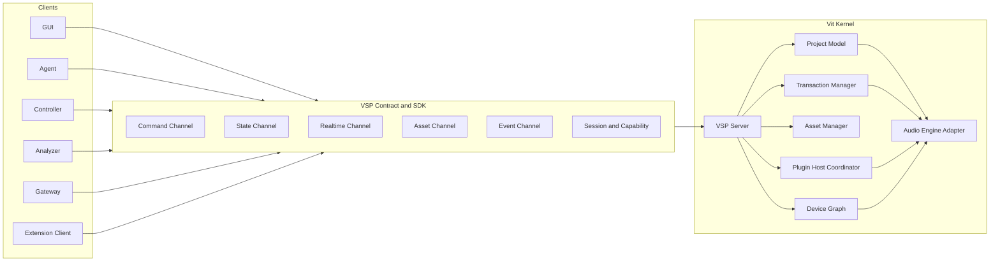

# VSP v1 Foundation Spec

## 1. 定位

VSP，Vit Session Protocol，是 Vit DAW 的会话协议与 SDK 契约。它负责定义 Vit Kernel、GUI、Agent、Controller、Analyzer、Gateway、Extension Client 之间如何发现能力、订阅状态、发送命令、接收实时数据、引用资产、处理错误和保持版本兼容。

VSP 不是单根传输协议。它是一套应用层契约，底层可以按数据属性选择 IPC、TCP、ZMQ、shared memory、文件资产缓存、WebSocket、OSC、MIDI 或未来传输。

核心原则：

- 音频实时线程不能被 GUI、Agent、网络、文件 I/O 或 JSON 编码阻塞。
- GUI 不接收全量状态洪水；GUI 只接收当前视图需要的状态 delta、实时 latest-only 数据和资产引用。
- Agent 不直接解析 GUI 状态；Agent 面向 Kernel 的正式能力、状态和工具通道。
- Kernel 是工程真源；GUI 和 Agent 都是客户端，不各自发明事实。
- VSP 对外不暴露 Tracktion Engine 私有语义。当前 TE 只是 Vit Kernel 内部的 Audio Engine Adapter。

## 2. 角色层

### 核心角色

| 角色 | 职责 |
|---|---|
| Kernel | 工程真源、音频引擎宿主、事务执行、状态发布、资产管理、权限裁决 |
| GUI | 用户界面、时间线、mixer、编辑交互、可视化展示 |
| Agent | 高层语义控制、自动化工作流、插件抓手、规划、解释与确认 |

### 外部接口角色

| 角色 | 职责 |
|---|---|
| Controller | MIDI 硬件、手机控制器、控制面板、快捷键面板 |
| Analyzer | 频谱、电平、响度、音乐信息检索、外部分析器 |
| Gateway | WebSocket、MCP、OSC、MIDI、第三方集成桥 |
| Extension Client | 自定义 GUI、扩展工具、第三方工作流客户端 |

### Kernel 内部建议边界

| 模块 | 职责 |
|---|---|
| VSP Server | 会话、通道、订阅、命令路由、SDK 契约 |
| Project Model | 工程对象模型、稳定 ID、snapshot/delta 生成 |
| Transaction Manager | 命令事务、撤销、批量提交、错误回滚 |
| Permission / Session | 客户端身份、能力声明、授权 |
| Asset Manager | 波形、peak、spectrum tile、渲染文件、缓存引用 |
| Device Graph | 音频设备、路由、轨道 I/O、控制器 |
| Plugin Host Coordinator | 插件实例、参数、宏控、插件执行回执 |
| Audio Engine Adapter | 当前为 TE Runtime，未来可替换为 Vit Audio Engine |

## 3. 总体结构图



## 4. 通道模型

VSP v1 必须至少定义以下通道。

| 通道 | 典型数据 | 顺序要求 | 丢弃策略 | 推荐传输 |
|---|---|---|---|---|
| Command | play、import、move clip、plugin batch apply | 必须有序，必须回执 | 不可丢 | IPC/TCP/ZMQ REQ/ROUTER |
| State | project snapshot、track delta、clip delta、selection | revision 有序 | 可合并旧 delta | IPC/TCP/ZMQ PUB/SUB |
| Realtime | meters、visible spectrum、transport playhead | latest-only | 可丢旧包 | shared memory ring + lightweight notify |
| Asset | waveform peak、spectrum tile、render result | 资产版本有序 | 不直接推大 payload | 文件缓存/mmap/shared memory |
| Event | job progress、import progress、plugin scan progress | 同 job 内有序 | 可限频 | PUB/SUB 或 event stream |
| Session | hello、capability、permission、heartbeat | 必须可靠 | 不可丢 | Command 同源 |

### 关键分离

- Command 不能和 telemetry 混在一个无优先级队列里。
- Realtime 不能走大 JSON 状态广播。
- Asset 不能通过 UDP 传大 payload；只传 URI、hash、revision、range、tile id。
- State 不能每次全量推送完整工程；必须 snapshot + delta。
- GUI 当前不可见区域不能订阅完整实时数据。

## 5. 状态模型

VSP 状态以 snapshot + delta 为基础。

| 名称 | 含义 |
|---|---|
| Snapshot | 某一 revision 的完整状态基线 |
| Delta | 从一个 revision 到下一个 revision 的变化量 |
| Revision | 单调递增状态版本 |
| Transaction ID | 一组命令执行的事务标识 |
| Object ID | Track、Clip、Plugin、Macro、Asset 等稳定对象 ID |
| Epoch | 工程重新打开、内核重启或状态基线失效后的新世代 |

规则：

1. 客户端连接后必须先取得 snapshot，再接 delta。
2. 客户端发现 delta 缺口时必须请求 resync snapshot。
3. Delta 必须引用 `base_revision` 和 `revision`。
4. 同一 object 的 ID 必须跨 GUI、Agent、Kernel 一致。
5. UI 行号、屏幕坐标、列表 index 不能作为长期对象地址。

## 6. 实时数据规则

实时数据分为两类：

1. 控制实时：播放指针、电平、可见轨 spectrum、录音状态。
2. 音频资产实时/准实时：波形 peak、频谱 tile、导入 bake 进度。

规则：

- Realtime 通道默认 latest-only，旧帧可丢弃。
- 可见范围订阅优先，GUI 不应订阅所有轨道的全部实时频谱。
- 播放指针、电平、频谱要有独立节流和优先级。
- 17 条左右可见轨的电平/实时频谱是 GUI 基准目标，但不可见轨只保留低频摘要或不订阅。
- 任何实时数据都不能导致 Godot 节点无限创建或不可见对象常驻刷新。

## 7. 资产模型

VSP 只传资产引用，不直接传大块资产内容。

资产类型：

- audio source
- waveform peak
- spectral peak / spectral tile
- render output
- import staging file
- plugin preset/profile
- mix analysis package

资产引用字段建议：

```json
{
  "asset_id": "asset_...",
  "kind": "waveform_peak",
  "uri": "vit-cache://project/.../peak.bin",
  "revision": 12,
  "byte_range": [0, 4096],
  "sample_rate": 48000,
  "channels": 2,
  "duration_seconds": 183.2,
  "hash": "..."
}
```

规则：

- GUI 需要波形时按 viewport 请求 peak/tile。
- Agent 需要分析时请求 compact analysis package，不读取 GUI 专用 tile。
- Asset Manager 负责缓存生命周期、hash、revision 和失效通知。

## 8. 命令与事务

命令必须是可验证的工程动作，而不是裸字符串。

命令基础字段：

```json
{
  "vsp_version": "1.0",
  "client_id": "agent.main",
  "request_id": "req_...",
  "command": "clip.move",
  "transaction_id": "tx_...",
  "args": {}
}
```

回执基础字段：

```json
{
  "request_id": "req_...",
  "status": "ok",
  "transaction_id": "tx_...",
  "revision": 101,
  "changed": ["clip:5012", "track:1007"],
  "warnings": []
}
```

规则：

- 写命令必须有 request_id。
- 多参数、多对象操作必须支持 batch/transaction。
- 失败要区分 validation_error、not_found、busy、permission_denied、timeout、partial_failure。
- GUI 和 Agent 都不能靠刷新全量状态猜命令是否成功。

## 9. 插件与设备

插件抓手智能保留在 Agent 侧。VSP 必须支持插件执行通道：

- plugin.scan
- plugin.instantiate
- plugin.describe_parameters
- plugin.apply_control
- plugin.set_params_batch
- plugin.begin_gesture
- plugin.update_gesture
- plugin.end_gesture
- plugin.readback
- plugin.open_native_ui
- macro.create
- macro.bind
- macro.set_values

插件通道目标：

- 多参数一次提交。
- 返回实际 host value、display text、changed params、profile stale 信息。
- 支持 GUI/Controller 对参数拖动的 gesture 流程。
- Agent 高层语义控制通过 batch/transaction 落地，不逐帧发送 set_parameter。

## 10. 权限与能力

每个客户端连接时必须声明角色和能力。

示例：

```json
{
  "client_id": "agent.main",
  "role": "agent",
  "wants": [
    "project.read",
    "project.write",
    "plugin.control",
    "render.offline",
    "analysis.read"
  ]
}
```

权限粒度建议：

- project.read
- project.write
- transport.control
- track.edit
- clip.edit
- plugin.read
- plugin.control
- plugin.scan
- asset.read
- asset.write
- realtime.subscribe
- render.offline
- filesystem.import
- filesystem.export

本地默认可以宽松，但协议必须保留能力模型，方便未来第三方客户端、权限 UI 和沙箱。

## 11. 版本与兼容

VSP v1 必须支持：

- schema version
- feature flags
- capability negotiation
- deprecated field grace period
- legacy IPC adapter
- conformance tests

原则：

1. 外部客户端只依赖 VSP 语义，不依赖 TE。
2. 当前旧 IPC 命令可以被包装为 legacy command adapter。
3. 新功能优先在 VSP schema 定义，再决定是否向旧 IPC 暴露兼容入口。
4. 自研内核替换 TE 时，VSP 客户端不应感知底层替换。

## 12. 性能目标

VSP v1 Foundation 的最低性能目标：

- 60 轨导入后 GUI 不冻结。
- 时间线滚动到任意轨道不出现随滚动范围累计恶化的卡顿。
- 17 条可见轨可显示电平和实时 spectrum，非可见轨不消耗同等级实时 UI 资源。
- 播放指针在播放时稳定刷新，不被导入、波形加载或状态 delta 阻塞。
- Agent 命令回执低延迟，不依赖全量工程快照确认。
- 插件 batch control 支持一次命令写多个参数并回读结果。
- 大资产通过引用和缓存访问，不通过 UDP/JSON payload 推送。

## 13. 迁移原则

1. 不一次性删除旧 IPC。
2. 先新增 VSP Server skeleton 和 schema。
3. 先迁 Command/Session，再迁 State，再迁 Realtime/Asset。
4. GUI 迁移时优先解决 timeline、track virtualization、meters、spectrum、playhead。
5. Agent 迁移时优先解决 observe/execute/reobserve、plugin apply、import、project state。
6. 每迁一个通道必须有 conformance test 和 smoke test。

